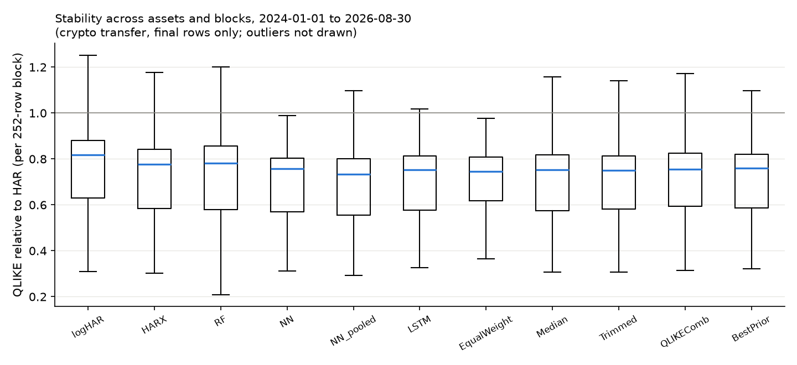

# Realized Volatility Forecasting: HAR vs Machine Learning on Stocks and Crypto

Which gains in next-day realized-variance forecasting hold up under a fair comparison and on a
different asset class? I compare HAR, log-HAR, HAR-X, a random forest, the NN3 network of
Christensen, Siggaard & Veliyev (2023) and an LSTM in one walk-forward harness, where every model
gets the same rows, refit dates and validation split. I also test pooled versus asset-specific
models and forecast combinations whose weights use only past out-of-sample forecasts. I set up
the protocol on five US stocks and then applied it without retuning to eight crypto assets built
from public Binance 5-minute data.

This started as my ML in Finance course project at the New Economic School. This version adds
the common harness, pooled models, combinations, the crypto transfer and paired model contrasts
with a joint date bootstrap.

## Results

Crypto, held-out period 2024-01 to 2026-08 (973 days x 8 assets):
- **The log target does most of the work.** log-HAR's mean QLIKE is 0.1244 lower than level
  HAR (95% joint bootstrap interval -0.1887 to -0.0471) and lower for 7 of the 8 assets; TRX
  accounts for about half of the average gain.
- **Averaging protects.** The equal-weight average of the five models has a lower loss than the
  models' average loss on every asset, because it avoids models that break on particular assets
  and days. Differences from log-HAR and pooled NN3 are not statistically resolved.
- **Extra features, nonlinear learners and pooling** do not give a significant gain in crypto. On
  stocks, richer features including implied volatility do lower the loss, and the pooled NN3
  beats equal weighting.

| Paired QLIKE difference (95% joint bootstrap) | Crypto 2024-01..2026-08 | Stocks 2014-08..2017-12 |
|---|---:|---:|
| log-HAR minus HAR (log target, same regressors) | -0.1244 [-0.1887, -0.0471] | -0.0172 [-0.0233, -0.0079] |
| HAR-X minus log-HAR (extra asset features) | +0.0240 [-0.0203, +0.1090] | -0.0265 [-0.0387, -0.0174] |
| NN3 pooled minus NN3 asset-specific | -0.0314 [-0.0943, +0.0024] | -0.0017 [-0.0055, +0.0027] |
| Equal weight minus the models' average loss | -0.0366 [-0.0721, -0.0158] | -0.0078 [-0.0091, -0.0067] |
| Equal weight minus best prior model | -0.0253 [-0.1168, +0.0262] | -0.0031 [-0.0086, +0.0004] |

*Negative: the first forecast has the lower loss. QLIKE is x - log x - 1 with x = RV / forecast.
Intervals resample 20-day blocks of dates and keep all assets of a drawn date together, because
assets share volatility shocks.*

| QLIKE relative to HAR, mean over assets | Stocks 2014-08..2017-12 | Crypto 2024-01..2026-08 |
|---|---:|---:|
| NN3 pooled across assets | 0.783 | 0.737 |
| LSTM | 0.791 | 0.746 |
| Random forest | 0.835 | 0.761 |
| log-HAR | 0.921 | 0.783 |
| Equal-weight combination | 0.806 | 0.752 |
| Trimmed mean (drop highest and lowest) | 0.795 | 0.732 |



The tables and figure show the original frozen run. A later correction to quarticity on days
with missing bars leaves the paired contrasts' signs and interval conclusions unchanged
([correction results](reports/results_crypto_g21_final.md)). These are forecast-loss comparisons.
The stock evaluation includes AAPL rows used in the course exercise, and the BTC/ETH calendar
overlaps another study in this portfolio; [research notes](reports/research_note.md) document
sample exposure and the correction rerun.

## Data

- **Crypto:** Binance spot 5-minute klines for BTC, ETH, BNB, XRP, ADA, LTC, TRX and XLM (public,
  checksum-verified), turned into daily realized variance, realized quarticity and HAR features.
  Days with missing bars use a quarticity estimator that accounts for the gaps.
- **Stocks:** five US stocks from the course dataset (not redistributed). The files had no dates,
  so I inferred an approximate calendar by matching return signs to public daily prices
  (`scripts/recover_dates.py`); these dates are not authoritative.

## How it works

- **Harness** (`src/rvf/harness.py`, `src/rvf/models.py`): expanding-window refits on a fixed
  schedule, inner validation for hyperparameters, log forecasts mapped back to variance with a
  training-only smearing factor, past-only scaling for pooled fits.
- **Combinations** (`src/rvf/combine.py`): equal weight, median, trimmed mean, QLIKE-weighted and
  best prior model, with weights from earlier out-of-sample forecasts only.
- **Inference** (`src/rvf/paired.py`): paired loss differences on all assets and dates, a joint
  moving-block bootstrap over dates and a Newey-West t.

## Run

```bash
make test               # harness timing, smearing, QLIKE, combinations, paired losses
make demo               # synthetic HAR process, no network
make data-public        # public Binance 5-minute klines -> crypto panels
make reproduce-public   # crypto study, paired losses, reports
make data-private reproduce-private   # stock study (needs the course files)
```

Detailed tables: [reports/results_crypto_final.md](reports/results_crypto_final.md),
[reports/results_final.md](reports/results_final.md).

## References

- F. Corsi. A Simple Approximate Long-Memory Model of Realized Volatility. *Journal of Financial
  Econometrics* 7(2), 2009.
- K. Christensen, M. Siggaard, B. Veliyev. A Machine Learning Approach to Volatility Forecasting.
  *Journal of Financial Econometrics* 21(5), 2023.
- A. J. Patton. Volatility forecast comparison using imperfect volatility proxies. *Journal of
  Econometrics* 160(1), 2011.
