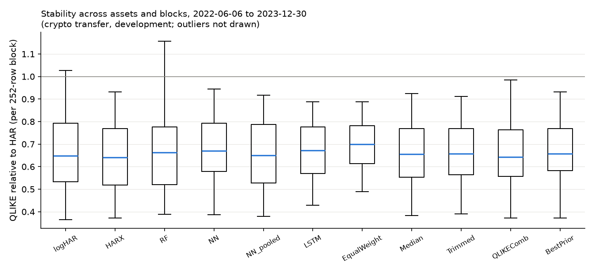

# Development results (crypto_dev)

Generated from `results/crypto_dev/` (config `4ed99606705e`, source tree `28b6e6ed6f1a`). Common evaluation rows 1252-1824 (2022-06-06 to 2023-12-30) for every asset and model. Crypto protocol transfer: eight Binance spot assets, 5-minute realized variance, the frozen stock protocol without retuning (no implied volatility, earnings or macro features). Target: next-day realized variance.

Status: development sample.

## QLIKE relative to HAR by asset

| model         |   ADAUSDT |   BNBUSDT |   BTCUSDT |   ETHUSDT |   LTCUSDT |   TRXUSDT |   XLMUSDT |   XRPUSDT |
|:--------------|----------:|----------:|----------:|----------:|----------:|----------:|----------:|----------:|
| HAR           |     1.000 |     1.000 |     1.000 |     1.000 |     1.000 |     1.000 |     1.000 |     1.000 |
| logHAR        |     0.555 |     0.583 |     0.826 |     0.682 |     0.764 |     0.382 |     0.866 |     1.107 |
| HARX          |     0.540 |     0.571 |     0.790 |     0.676 |     0.770 |     0.388 |     0.808 |     1.094 |
| RF            |     0.557 |     0.590 |     0.963 |     0.691 |     0.766 |     0.429 |     0.805 |     1.045 |
| NN            |     0.581 |     0.601 |     0.844 |     0.663 |     0.791 |     0.423 |     0.841 |     1.011 |
| LSTM          |     0.613 |     0.633 |     0.793 |     0.640 |     0.793 |     0.458 |     0.779 |     0.986 |
| EqualWeight   |     0.630 |     0.640 |     0.763 |     0.674 |     0.784 |     0.510 |     0.801 |     0.968 |
| QLIKEComb     |     0.601 |     0.571 |     0.831 |     0.643 |     0.771 |     0.416 |     0.789 |     1.036 |
| BestPrior     |     0.625 |     0.571 |     0.812 |     0.661 |     0.770 |     0.416 |     0.809 |     1.086 |
| logHAR_pooled |     0.554 |     0.575 |     0.810 |     0.678 |     0.768 |     0.382 |     0.865 |     1.098 |
| RF_pooled     |     0.534 |     0.569 |     0.815 |     0.645 |     0.752 |     0.425 |     0.814 |     1.109 |
| NN_pooled     |     0.548 |     0.578 |     0.781 |     0.668 |     0.792 |     0.408 |     0.798 |     1.070 |
| Median        |     0.578 |     0.602 |     0.800 |     0.652 |     0.770 |     0.417 |     0.805 |     1.000 |
| Trimmed       |     0.580 |     0.596 |     0.797 |     0.649 |     0.771 |     0.421 |     0.806 |     1.007 |
| EW_wo_HAR     |     0.562 |     0.585 |     0.818 |     0.647 |     0.771 |     0.411 |     0.799 |     1.023 |
| EW_wo_HARX    |     0.663 |     0.670 |     0.774 |     0.694 |     0.796 |     0.555 |     0.810 |     0.953 |
| EW_wo_RF      |     0.657 |     0.665 |     0.766 |     0.693 |     0.797 |     0.547 |     0.810 |     0.960 |
| EW_wo_NN      |     0.646 |     0.655 |     0.760 |     0.684 |     0.788 |     0.538 |     0.797 |     0.962 |
| EW_wo_LSTM    |     0.639 |     0.646 |     0.768 |     0.687 |     0.788 |     0.528 |     0.813 |     0.970 |

## Newey-West t-statistic of the QLIKE gain over HAR (positive = better than HAR)

| model         |   ADAUSDT |   BNBUSDT |   BTCUSDT |   ETHUSDT |   LTCUSDT |   TRXUSDT |   XLMUSDT |   XRPUSDT |
|:--------------|----------:|----------:|----------:|----------:|----------:|----------:|----------:|----------:|
| HAR           |    nan    |    nan    |    nan    |    nan    |    nan    |    nan    |    nan    |    nan    |
| logHAR        |      6.23 |      4.95 |      1.01 |      2.19 |      3.40 |      9.14 |      0.68 |     -0.43 |
| HARX          |      6.92 |      5.43 |      1.30 |      2.24 |      2.97 |      9.18 |      1.28 |     -0.37 |
| RF            |      7.04 |      5.93 |      0.13 |      2.49 |      3.20 |      8.01 |      1.43 |     -0.21 |
| NN            |      7.93 |      6.32 |      1.02 |      3.59 |      2.50 |      9.74 |      1.12 |     -0.06 |
| LSTM          |      8.30 |      6.54 |      1.61 |      5.38 |      2.46 |     10.59 |      1.88 |      0.08 |
| EqualWeight   |      9.22 |      8.14 |      2.87 |      5.66 |      3.88 |     13.56 |      2.05 |      0.25 |
| QLIKEComb     |      8.12 |      5.70 |      0.91 |      4.11 |      2.93 |      8.56 |      1.57 |     -0.17 |
| BestPrior     |      8.03 |      5.43 |      1.17 |      2.82 |      2.97 |      8.54 |      1.29 |     -0.34 |
| logHAR_pooled |      6.18 |      5.27 |      1.23 |      2.25 |      3.24 |      9.77 |      0.68 |     -0.39 |
| RF_pooled     |      6.96 |      5.99 |      1.24 |      3.31 |      3.34 |      8.35 |      1.12 |     -0.42 |
| NN_pooled     |      6.80 |      5.93 |      1.62 |      2.63 |      2.47 |     10.28 |      1.44 |     -0.32 |
| Median        |      8.27 |      6.50 |      1.29 |      3.68 |      3.20 |     10.43 |      1.45 |      0.00 |
| Trimmed       |      8.17 |      6.82 |      1.40 |      4.00 |      3.21 |     10.52 |      1.48 |     -0.04 |
| EW_wo_HAR     |      7.86 |      6.47 |      1.09 |      3.59 |      2.98 |      9.89 |      1.48 |     -0.12 |
| EW_wo_HARX    |      9.62 |      8.55 |      3.15 |      6.34 |      3.98 |     14.05 |      2.21 |      0.43 |
| EW_wo_RF      |      9.68 |      8.47 |      3.52 |      6.29 |      3.83 |     14.39 |      2.16 |      0.35 |
| EW_wo_NN      |      9.46 |      8.45 |      3.27 |      6.10 |      4.23 |     14.39 |      2.33 |      0.31 |
| EW_wo_LSTM    |      9.22 |      8.35 |      3.10 |      5.63 |      4.21 |     14.05 |      2.03 |      0.25 |

## Average over assets: relative losses, bias, Mincer-Zarnowitz (RV = a + b f)

| model         |   QLIKE_rel_HAR |   MSE_rel_HAR |   MAE_rel_HAR |   bias_rel |   MZ_a |   MZ_b |
|:--------------|----------------:|--------------:|--------------:|-----------:|-------:|-------:|
| HAR           |           1.000 |         1.000 |         1.000 |      0.568 | -0.001 |  1.033 |
| logHAR        |           0.721 |         0.846 |         0.611 |      0.003 |  0.000 |  0.876 |
| HARX          |           0.705 |         0.819 |         0.604 |      0.018 |  0.000 |  0.878 |
| RF            |           0.731 |         0.828 |         0.612 |      0.019 |  0.000 |  0.888 |
| NN            |           0.719 |         0.839 |         0.635 |      0.049 |  0.000 |  0.940 |
| LSTM          |           0.712 |         0.835 |         0.625 |      0.037 |  0.000 |  0.997 |
| EqualWeight   |           0.721 |         0.823 |         0.671 |      0.138 | -0.000 |  0.992 |
| QLIKEComb     |           0.707 |         0.818 |         0.610 |      0.022 |  0.000 |  0.961 |
| BestPrior     |           0.719 |         0.836 |         0.617 |      0.024 |  0.000 |  0.914 |
| logHAR_pooled |           0.716 |         0.846 |         0.615 |      0.018 |  0.000 |  0.865 |
| RF_pooled     |           0.708 |         0.818 |         0.599 |      0.012 |  0.000 |  0.911 |
| NN_pooled     |           0.705 |         0.832 |         0.623 |      0.050 |  0.000 |  0.882 |
| Median        |           0.703 |         0.819 |         0.622 |      0.046 |  0.000 |  0.973 |
| Trimmed       |           0.704 |         0.820 |         0.626 |      0.052 |  0.000 |  0.971 |
| EW_wo_HAR     |           0.702 |         0.812 |         0.612 |      0.031 |  0.000 |  0.957 |
| EW_wo_HARX    |           0.739 |         0.835 |         0.693 |      0.168 | -0.000 |  1.013 |
| EW_wo_RF      |           0.737 |         0.829 |         0.691 |      0.168 | -0.000 |  1.009 |
| EW_wo_NN      |           0.729 |         0.825 |         0.683 |      0.161 | -0.000 |  0.997 |
| EW_wo_LSTM    |           0.730 |         0.828 |         0.686 |      0.164 | -0.000 |  0.973 |

## Pooled over asset-specific QLIKE (same rows; < 1 = pooled better)

| model   |   ADAUSDT |   BNBUSDT |   BTCUSDT |   ETHUSDT |   LTCUSDT |   TRXUSDT |   XLMUSDT |   XRPUSDT |
|:--------|----------:|----------:|----------:|----------:|----------:|----------:|----------:|----------:|
| NN      |     0.944 |     0.961 |     0.925 |     1.008 |     1.001 |     0.965 |     0.949 |     1.059 |
| RF      |     0.960 |     0.964 |     0.846 |     0.933 |     0.982 |     0.990 |     1.012 |     1.061 |
| logHAR  |     0.998 |     0.986 |     0.981 |     0.993 |     1.006 |     1.000 |     0.999 |     0.992 |

## Latest data-driven combination weights (grid on the simplex, prior OOS history)

|         |   HAR |   HARX |   RF |   NN |   LSTM |
|:--------|------:|-------:|-----:|-----:|-------:|
| BTCUSDT |  0.20 |   0.80 | 0.00 | 0.00 |   0.00 |
| ETHUSDT |  0.00 |   0.00 | 0.40 | 0.00 |   0.60 |
| BNBUSDT |  0.00 |   0.70 | 0.30 | 0.00 |   0.00 |
| XRPUSDT |  0.40 |   0.00 | 0.00 | 0.00 |   0.60 |
| ADAUSDT |  0.00 |   0.00 | 1.00 | 0.00 |   0.00 |
| LTCUSDT |  0.00 |   0.70 | 0.30 | 0.00 |   0.00 |
| TRXUSDT |  0.00 |   0.90 | 0.00 | 0.10 |   0.00 |
| XLMUSDT |  0.00 |   0.10 | 0.10 | 0.00 |   0.80 |

## QLIKE relative to HAR by calendar year (mean over assets)

|   year |   HARX |    NN |   EqualWeight |   QLIKEComb |   BestPrior |   Median |   NN_pooled |
|-------:|-------:|------:|--------------:|------------:|------------:|---------:|------------:|
|   2022 |  0.606 | 0.662 |         0.684 |       0.627 |       0.634 |    0.636 |       0.635 |
|   2023 |  0.736 | 0.737 |         0.732 |       0.733 |       0.745 |    0.724 |       0.726 |

## Raw losses with cross-asset dependence preserved

Panel means over 573 dates x 8 assets. Intervals: 95% moving-block bootstrap over DATES (block 20, 2000 draws), every asset of a drawn date kept together. Ratios are shown as the pooled ratio of mean losses and as the mean of per-asset ratios (the form used in the tables above).

| model         |   raw QLIKE | difference vs HAR          | pooled ratio vs HAR   | mean of asset ratios   |
|:--------------|------------:|:---------------------------|:----------------------|:-----------------------|
| HAR           |      0.5184 | 0.0000 [0.0000, 0.0000]    | 1.000 [1.000, 1.000]  | 1.000 [1.000, 1.000]   |
| logHAR        |      0.3638 | -0.1546 [-0.2372, -0.0739] | 0.702 [0.532, 0.864]  | 0.721 [0.554, 0.857]   |
| HARX          |      0.3565 | -0.1620 [-0.2410, -0.0853] | 0.688 [0.521, 0.848]  | 0.705 [0.544, 0.837]   |
| RF            |      0.3713 | -0.1472 [-0.2292, -0.0723] | 0.716 [0.549, 0.874]  | 0.731 [0.567, 0.869]   |
| NN            |      0.3638 | -0.1546 [-0.2222, -0.0938] | 0.702 [0.564, 0.832]  | 0.719 [0.583, 0.828]   |
| LSTM          |      0.3614 | -0.1570 [-0.2193, -0.1017] | 0.697 [0.571, 0.815]  | 0.712 [0.585, 0.811]   |
| EqualWeight   |      0.3674 | -0.1510 [-0.2000, -0.1071] | 0.709 [0.610, 0.805]  | 0.721 [0.622, 0.800]   |
| QLIKEComb     |      0.3583 | -0.1601 [-0.2319, -0.0932] | 0.691 [0.541, 0.831]  | 0.707 [0.561, 0.825]   |
| BestPrior     |      0.3639 | -0.1545 [-0.2293, -0.0818] | 0.702 [0.545, 0.851]  | 0.719 [0.565, 0.842]   |
| logHAR_pooled |      0.3615 | -0.1570 [-0.2388, -0.0776] | 0.697 [0.532, 0.858]  | 0.716 [0.552, 0.850]   |
| RF_pooled     |      0.3597 | -0.1587 [-0.2378, -0.0832] | 0.694 [0.534, 0.850]  | 0.708 [0.551, 0.836]   |
| NN_pooled     |      0.357  | -0.1614 [-0.2372, -0.0913] | 0.689 [0.536, 0.833]  | 0.705 [0.555, 0.827]   |
| Median        |      0.3559 | -0.1625 [-0.2295, -0.1012] | 0.686 [0.549, 0.817]  | 0.703 [0.568, 0.810]   |
| Trimmed       |      0.3562 | -0.1622 [-0.2283, -0.1025] | 0.687 [0.552, 0.818]  | 0.704 [0.570, 0.809]   |
| EW_wo_HAR     |      0.3555 | -0.1629 [-0.2337, -0.0973] | 0.686 [0.541, 0.825]  | 0.702 [0.560, 0.815]   |
| EW_wo_HARX    |      0.3776 | -0.1408 [-0.1838, -0.1025] | 0.728 [0.642, 0.813]  | 0.739 [0.652, 0.808]   |
| EW_wo_RF      |      0.3761 | -0.1423 [-0.1863, -0.1035] | 0.726 [0.637, 0.811]  | 0.737 [0.649, 0.806]   |
| EW_wo_NN      |      0.372  | -0.1464 [-0.1920, -0.1056] | 0.718 [0.626, 0.807]  | 0.729 [0.637, 0.801]   |
| EW_wo_LSTM    |      0.3721 | -0.1463 [-0.1923, -0.1048] | 0.718 [0.624, 0.809]  | 0.730 [0.637, 0.803]   |

## Paired contrasts: where does the gain come from?

Negative difference: the first forecast has the lower loss. `MeanMemberLoss` is the average loss of the five equal-weight members, not a forecast. NW t: Newey-West (5 lags) t-statistic of the cross-asset mean daily difference.

| contrast               | a vs b                        | raw QLIKE a / b   | difference a - b           |   NW t | pooled ratio         |   assets a lower (of 8) |
|:-----------------------|:------------------------------|:------------------|:---------------------------|-------:|:---------------------|------------------------:|
| target_scale           | logHAR vs HAR                 | 0.3638 / 0.5184   | -0.1546 [-0.2372, -0.0739] |  -3.51 | 0.702 [0.532, 0.864] |                       7 |
| features               | HARX vs logHAR                | 0.3565 / 0.3638   | -0.0074 [-0.0161, +0.0009] |  -1.79 | 0.980 [0.959, 1.003] |                       6 |
| nonlinear_RF           | RF vs HARX                    | 0.3713 / 0.3565   | +0.0148 [+0.0004, +0.0307] |   2.01 | 1.042 [1.001, 1.080] |                       3 |
| nonlinear_NN           | NN vs HARX                    | 0.3638 / 0.3565   | +0.0073 [-0.0105, +0.0225] |   0.82 | 1.021 [0.977, 1.086] |                       2 |
| nonlinear_LSTM         | LSTM vs HARX                  | 0.3614 / 0.3565   | +0.0049 [-0.0204, +0.0258] |   0.39 | 1.014 [0.959, 1.096] |                       3 |
| pooling_logHAR         | logHAR_pooled vs logHAR       | 0.3615 / 0.3638   | -0.0024 [-0.0061, +0.0006] |  -1.32 | 0.993 [0.986, 1.002] |                       7 |
| pooling_RF             | RF_pooled vs RF               | 0.3597 / 0.3713   | -0.0115 [-0.0345, +0.0064] |  -1.08 | 0.969 [0.921, 1.016] |                       6 |
| pooling_NN             | NN_pooled vs NN               | 0.3570 / 0.3638   | -0.0067 [-0.0173, +0.0035] |  -1.35 | 0.981 [0.943, 1.008] |                       5 |
| averaging_vs_selection | EqualWeight vs BestPrior      | 0.3674 / 0.3639   | +0.0035 [-0.0281, +0.0329] |   0.2  | 1.010 [0.943, 1.121] |                       3 |
| averaging_vs_members   | EqualWeight vs MeanMemberLoss | 0.3674 / 0.3943   | -0.0268 [-0.0428, -0.0144] |  -3.34 | 0.932 [0.914, 0.956] |                       8 |
| protection_drop_HAR    | EW_wo_HAR vs EqualWeight      | 0.3555 / 0.3674   | -0.0120 [-0.0356, +0.0131] |  -0.88 | 0.967 [0.885, 1.028] |                       6 |
| protection_median      | Median vs EqualWeight         | 0.3559 / 0.3674   | -0.0115 [-0.0311, +0.0084] |  -1.04 | 0.969 [0.901, 1.018] |                       5 |
| protection_trimmed     | Trimmed vs EqualWeight        | 0.3562 / 0.3674   | -0.0112 [-0.0293, +0.0075] |  -1.08 | 0.970 [0.906, 1.017] |                       5 |
| context_pooled_NN      | EqualWeight vs NN_pooled      | 0.3674 / 0.3570   | +0.0104 [-0.0179, +0.0383] |   0.65 | 1.029 [0.963, 1.141] |                       3 |
| context_logHAR         | EqualWeight vs logHAR         | 0.3674 / 0.3638   | +0.0036 [-0.0371, +0.0411] |   0.17 | 1.010 [0.927, 1.149] |                       4 |
| context_pooled_logHAR  | EqualWeight vs logHAR_pooled  | 0.3674 / 0.3615   | +0.0060 [-0.0326, +0.0416] |   0.29 | 1.017 [0.934, 1.152] |                       4 |

### Sensitivity: without target days below 95% bar coverage

1 evaluation date(s) excluded (any asset with fewer than 274 of 288 bars on the target day); the same forecasts are rescored.

| contrast               | a vs b                        | raw QLIKE a / b   | difference a - b           |   NW t | pooled ratio         |   assets a lower (of 8) |
|:-----------------------|:------------------------------|:------------------|:---------------------------|-------:|:---------------------|------------------------:|
| target_scale           | logHAR vs HAR                 | 0.3643 / 0.5190   | -0.1547 [-0.2378, -0.0747] |  -3.51 | 0.702 [0.533, 0.866] |                       7 |
| features               | HARX vs logHAR                | 0.3569 / 0.3643   | -0.0074 [-0.0162, +0.0012] |  -1.78 | 0.980 [0.959, 1.003] |                       6 |
| nonlinear_RF           | RF vs HARX                    | 0.3717 / 0.3569   | +0.0148 [+0.0006, +0.0306] |   2    | 1.041 [1.002, 1.080] |                       3 |
| nonlinear_NN           | NN vs HARX                    | 0.3642 / 0.3569   | +0.0073 [-0.0106, +0.0227] |   0.82 | 1.020 [0.977, 1.085] |                       2 |
| nonlinear_LSTM         | LSTM vs HARX                  | 0.3619 / 0.3569   | +0.0049 [-0.0205, +0.0258] |   0.38 | 1.014 [0.958, 1.097] |                       3 |
| pooling_logHAR         | logHAR_pooled vs logHAR       | 0.3619 / 0.3643   | -0.0024 [-0.0061, +0.0005] |  -1.33 | 0.993 [0.986, 1.002] |                       7 |
| pooling_RF             | RF_pooled vs RF               | 0.3602 / 0.3717   | -0.0116 [-0.0346, +0.0063] |  -1.08 | 0.969 [0.922, 1.016] |                       6 |
| pooling_NN             | NN_pooled vs NN               | 0.3575 / 0.3642   | -0.0068 [-0.0172, +0.0034] |  -1.36 | 0.981 [0.944, 1.008] |                       5 |
| averaging_vs_selection | EqualWeight vs BestPrior      | 0.3679 / 0.3644   | +0.0035 [-0.0283, +0.0328] |   0.2  | 1.009 [0.942, 1.121] |                       3 |
| averaging_vs_members   | EqualWeight vs MeanMemberLoss | 0.3679 / 0.3948   | -0.0269 [-0.0433, -0.0145] |  -3.34 | 0.932 [0.914, 0.956] |                       8 |
| protection_drop_HAR    | EW_wo_HAR vs EqualWeight      | 0.3559 / 0.3679   | -0.0119 [-0.0354, +0.0131] |  -0.88 | 0.968 [0.886, 1.028] |                       6 |
| protection_median      | Median vs EqualWeight         | 0.3563 / 0.3679   | -0.0115 [-0.0313, +0.0086] |  -1.04 | 0.969 [0.902, 1.019] |                       5 |
| protection_trimmed     | Trimmed vs EqualWeight        | 0.3567 / 0.3679   | -0.0112 [-0.0293, +0.0076] |  -1.08 | 0.970 [0.907, 1.017] |                       5 |
| context_pooled_NN      | EqualWeight vs NN_pooled      | 0.3679 / 0.3575   | +0.0104 [-0.0176, +0.0385] |   0.65 | 1.029 [0.963, 1.143] |                       3 |
| context_logHAR         | EqualWeight vs logHAR         | 0.3679 / 0.3643   | +0.0036 [-0.0370, +0.0409] |   0.16 | 1.010 [0.926, 1.148] |                       4 |
| context_pooled_logHAR  | EqualWeight vs logHAR_pooled  | 0.3679 / 0.3619   | +0.0060 [-0.0326, +0.0415] |   0.29 | 1.017 [0.933, 1.151] |                       4 |
