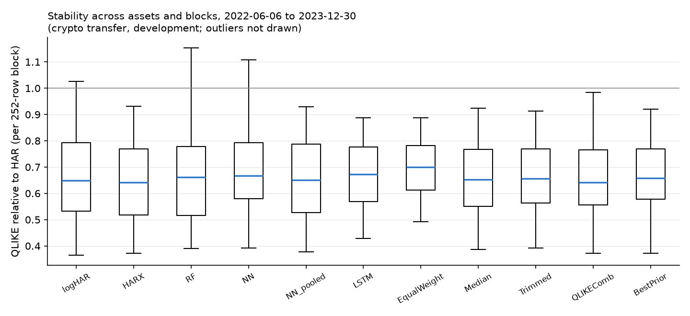

# Development results (crypto_g21_dev)

Generation 2.1 data-correction rerun of `results/crypto_dev/`: realized quarticity uses the span-aware scaling on days with missing 5-minute bars (`data/crypto_g21/`); models, hyperparameters, seeds, splits and evaluation are unchanged.

Generated from `results/crypto_g21_dev/` (config `4ed99606705e`, source tree `b0a61ff813e6`). Common evaluation rows 1252-1824 (2022-06-06 to 2023-12-30) for every asset and model. Crypto protocol transfer: eight Binance spot assets, 5-minute realized variance, the frozen stock protocol without retuning (no implied volatility, earnings or macro features). Target: next-day realized variance.

Status: development sample.

## QLIKE relative to HAR by asset

| model         |   ADAUSDT |   BNBUSDT |   BTCUSDT |   ETHUSDT |   LTCUSDT |   TRXUSDT |   XLMUSDT |   XRPUSDT |
|:--------------|----------:|----------:|----------:|----------:|----------:|----------:|----------:|----------:|
| HAR           |     1.000 |     1.000 |     1.000 |     1.000 |     1.000 |     1.000 |     1.000 |     1.000 |
| logHAR        |     0.555 |     0.583 |     0.826 |     0.682 |     0.764 |     0.382 |     0.866 |     1.107 |
| HARX          |     0.540 |     0.571 |     0.790 |     0.676 |     0.770 |     0.388 |     0.808 |     1.094 |
| RF            |     0.556 |     0.586 |     0.960 |     0.692 |     0.765 |     0.430 |     0.804 |     1.043 |
| NN            |     0.579 |     0.602 |     0.842 |     0.664 |     0.791 |     0.424 |     0.840 |     1.005 |
| LSTM          |     0.613 |     0.633 |     0.794 |     0.640 |     0.793 |     0.458 |     0.779 |     0.986 |
| EqualWeight   |     0.630 |     0.639 |     0.763 |     0.674 |     0.784 |     0.511 |     0.802 |     0.966 |
| QLIKEComb     |     0.602 |     0.572 |     0.830 |     0.645 |     0.772 |     0.416 |     0.791 |     1.037 |
| BestPrior     |     0.625 |     0.571 |     0.812 |     0.663 |     0.770 |     0.416 |     0.796 |     1.086 |
| logHAR_pooled |     0.554 |     0.575 |     0.810 |     0.678 |     0.768 |     0.382 |     0.865 |     1.098 |
| RF_pooled     |     0.534 |     0.569 |     0.815 |     0.645 |     0.750 |     0.424 |     0.815 |     1.111 |
| NN_pooled     |     0.548 |     0.580 |     0.781 |     0.667 |     0.788 |     0.407 |     0.805 |     1.067 |
| Median        |     0.578 |     0.601 |     0.801 |     0.653 |     0.770 |     0.419 |     0.805 |     0.997 |
| Trimmed       |     0.580 |     0.595 |     0.797 |     0.649 |     0.771 |     0.422 |     0.806 |     1.004 |
| EW_wo_HAR     |     0.561 |     0.584 |     0.817 |     0.647 |     0.770 |     0.412 |     0.799 |     1.020 |
| EW_wo_HARX    |     0.662 |     0.670 |     0.774 |     0.694 |     0.796 |     0.556 |     0.810 |     0.952 |
| EW_wo_RF      |     0.657 |     0.665 |     0.766 |     0.693 |     0.797 |     0.548 |     0.810 |     0.959 |
| EW_wo_NN      |     0.646 |     0.654 |     0.760 |     0.684 |     0.788 |     0.538 |     0.797 |     0.962 |
| EW_wo_LSTM    |     0.638 |     0.646 |     0.768 |     0.687 |     0.788 |     0.529 |     0.813 |     0.968 |

## Newey-West t-statistic of the QLIKE gain over HAR (positive = better than HAR)

| model         |   ADAUSDT |   BNBUSDT |   BTCUSDT |   ETHUSDT |   LTCUSDT |   TRXUSDT |   XLMUSDT |   XRPUSDT |
|:--------------|----------:|----------:|----------:|----------:|----------:|----------:|----------:|----------:|
| HAR           |    nan    |    nan    |    nan    |    nan    |    nan    |    nan    |    nan    |    nan    |
| logHAR        |      6.23 |      4.95 |      1.01 |      2.19 |      3.40 |      9.14 |      0.68 |     -0.43 |
| HARX          |      6.92 |      5.43 |      1.30 |      2.24 |      2.97 |      9.18 |      1.28 |     -0.37 |
| RF            |      7.07 |      5.99 |      0.15 |      2.48 |      3.17 |      7.95 |      1.42 |     -0.20 |
| NN            |      8.01 |      6.35 |      1.03 |      3.58 |      2.51 |      9.88 |      1.12 |     -0.03 |
| LSTM          |      8.30 |      6.54 |      1.61 |      5.38 |      2.46 |     10.59 |      1.88 |      0.08 |
| EqualWeight   |      9.24 |      8.17 |      2.87 |      5.66 |      3.87 |     13.57 |      2.05 |      0.26 |
| QLIKEComb     |      8.10 |      5.69 |      0.92 |      3.85 |      2.90 |      8.57 |      1.54 |     -0.17 |
| BestPrior     |      8.03 |      5.43 |      1.17 |      2.80 |      2.97 |      8.55 |      1.50 |     -0.34 |
| logHAR_pooled |      6.18 |      5.27 |      1.23 |      2.25 |      3.24 |      9.77 |      0.68 |     -0.39 |
| RF_pooled     |      6.97 |      5.98 |      1.24 |      3.31 |      3.38 |      8.42 |      1.11 |     -0.42 |
| NN_pooled     |      6.82 |      5.95 |      1.63 |      2.68 |      2.59 |     10.36 |      1.34 |     -0.30 |
| Median        |      8.28 |      6.54 |      1.29 |      3.67 |      3.20 |     10.57 |      1.44 |      0.02 |
| Trimmed       |      8.20 |      6.85 |      1.40 |      3.99 |      3.20 |     10.58 |      1.48 |     -0.02 |
| EW_wo_HAR     |      7.89 |      6.50 |      1.10 |      3.58 |      2.98 |      9.93 |      1.48 |     -0.10 |
| EW_wo_HARX    |      9.65 |      8.59 |      3.16 |      6.33 |      3.97 |     14.06 |      2.21 |      0.45 |
| EW_wo_RF      |      9.70 |      8.48 |      3.52 |      6.29 |      3.83 |     14.43 |      2.16 |      0.36 |
| EW_wo_NN      |      9.47 |      8.48 |      3.28 |      6.10 |      4.22 |     14.37 |      2.32 |      0.32 |
| EW_wo_LSTM    |      9.24 |      8.39 |      3.11 |      5.62 |      4.20 |     14.07 |      2.02 |      0.27 |

## Average over assets: relative losses, bias, Mincer-Zarnowitz (RV = a + b f)

| model         |   QLIKE_rel_HAR |   MSE_rel_HAR |   MAE_rel_HAR |   bias_rel |   MZ_a |   MZ_b |
|:--------------|----------------:|--------------:|--------------:|-----------:|-------:|-------:|
| HAR           |           1.000 |         1.000 |         1.000 |      0.568 | -0.001 |  1.033 |
| logHAR        |           0.721 |         0.846 |         0.611 |      0.003 |  0.000 |  0.876 |
| HARX          |           0.705 |         0.819 |         0.604 |      0.018 |  0.000 |  0.878 |
| RF            |           0.730 |         0.828 |         0.612 |      0.019 |  0.000 |  0.888 |
| NN            |           0.718 |         0.839 |         0.634 |      0.050 |  0.000 |  0.940 |
| LSTM          |           0.712 |         0.835 |         0.625 |      0.037 |  0.000 |  0.997 |
| EqualWeight   |           0.721 |         0.823 |         0.671 |      0.138 | -0.000 |  0.992 |
| QLIKEComb     |           0.708 |         0.819 |         0.610 |      0.023 |  0.000 |  0.954 |
| BestPrior     |           0.717 |         0.837 |         0.615 |      0.023 |  0.000 |  0.913 |
| logHAR_pooled |           0.716 |         0.846 |         0.615 |      0.018 |  0.000 |  0.865 |
| RF_pooled     |           0.708 |         0.815 |         0.599 |      0.012 |  0.000 |  0.917 |
| NN_pooled     |           0.705 |         0.833 |         0.624 |      0.051 |  0.000 |  0.876 |
| Median        |           0.703 |         0.819 |         0.622 |      0.046 |  0.000 |  0.974 |
| Trimmed       |           0.703 |         0.820 |         0.626 |      0.052 |  0.000 |  0.971 |
| EW_wo_HAR     |           0.701 |         0.812 |         0.612 |      0.031 |  0.000 |  0.957 |
| EW_wo_HARX    |           0.739 |         0.835 |         0.693 |      0.168 | -0.000 |  1.013 |
| EW_wo_RF      |           0.737 |         0.828 |         0.691 |      0.168 | -0.000 |  1.009 |
| EW_wo_NN      |           0.729 |         0.826 |         0.683 |      0.160 | -0.000 |  0.997 |
| EW_wo_LSTM    |           0.730 |         0.828 |         0.686 |      0.164 | -0.000 |  0.973 |

## Pooled over asset-specific QLIKE (same rows; < 1 = pooled better)

| model   |   ADAUSDT |   BNBUSDT |   BTCUSDT |   ETHUSDT |   LTCUSDT |   TRXUSDT |   XLMUSDT |   XRPUSDT |
|:--------|----------:|----------:|----------:|----------:|----------:|----------:|----------:|----------:|
| NN      |     0.946 |     0.964 |     0.928 |     1.006 |     0.997 |     0.959 |     0.958 |     1.062 |
| RF      |     0.960 |     0.971 |     0.849 |     0.932 |     0.980 |     0.985 |     1.013 |     1.065 |
| logHAR  |     0.998 |     0.986 |     0.981 |     0.993 |     1.006 |     1.000 |     0.999 |     0.992 |

## Latest data-driven combination weights (grid on the simplex, prior OOS history)

|         |   HAR |   HARX |   RF |   NN |   LSTM |
|:--------|------:|-------:|-----:|-----:|-------:|
| BTCUSDT |  0.20 |   0.80 | 0.00 | 0.00 |   0.00 |
| ETHUSDT |  0.00 |   0.00 | 0.40 | 0.00 |   0.60 |
| BNBUSDT |  0.00 |   0.70 | 0.30 | 0.00 |   0.00 |
| XRPUSDT |  0.40 |   0.00 | 0.00 | 0.00 |   0.60 |
| ADAUSDT |  0.00 |   0.00 | 1.00 | 0.00 |   0.00 |
| LTCUSDT |  0.00 |   0.70 | 0.30 | 0.00 |   0.00 |
| TRXUSDT |  0.00 |   0.90 | 0.00 | 0.10 |   0.00 |
| XLMUSDT |  0.00 |   0.00 | 0.20 | 0.00 |   0.80 |

## QLIKE relative to HAR by calendar year (mean over assets)

|   year |   HARX |    NN |   EqualWeight |   QLIKEComb |   BestPrior |   Median |   NN_pooled |
|-------:|-------:|------:|--------------:|------------:|------------:|---------:|------------:|
|   2022 |  0.606 | 0.661 |         0.683 |       0.626 |       0.631 |    0.634 |       0.635 |
|   2023 |  0.736 | 0.736 |         0.731 |       0.734 |       0.744 |    0.724 |       0.727 |

## Raw losses with cross-asset dependence preserved

Panel means over 573 dates x 8 assets. Intervals: 95% moving-block bootstrap over DATES (block 20, 2000 draws), every asset of a drawn date kept together. Ratios are shown as the pooled ratio of mean losses and as the mean of per-asset ratios (the form used in the tables above).

| model         |   raw QLIKE | difference vs HAR          | pooled ratio vs HAR   | mean of asset ratios   |
|:--------------|------------:|:---------------------------|:----------------------|:-----------------------|
| HAR           |      0.5184 | 0.0000 [0.0000, 0.0000]    | 1.000 [1.000, 1.000]  | 1.000 [1.000, 1.000]   |
| logHAR        |      0.3638 | -0.1546 [-0.2372, -0.0739] | 0.702 [0.532, 0.864]  | 0.721 [0.554, 0.857]   |
| HARX          |      0.3565 | -0.1620 [-0.2410, -0.0853] | 0.688 [0.521, 0.848]  | 0.705 [0.544, 0.837]   |
| RF            |      0.3706 | -0.1478 [-0.2296, -0.0727] | 0.715 [0.548, 0.872]  | 0.730 [0.567, 0.867]   |
| NN            |      0.3633 | -0.1551 [-0.2223, -0.0944] | 0.701 [0.563, 0.829]  | 0.718 [0.583, 0.826]   |
| LSTM          |      0.3614 | -0.1570 [-0.2193, -0.1017] | 0.697 [0.571, 0.815]  | 0.712 [0.585, 0.811]   |
| EqualWeight   |      0.3673 | -0.1511 [-0.2001, -0.1073] | 0.709 [0.610, 0.804]  | 0.721 [0.622, 0.799]   |
| QLIKEComb     |      0.3586 | -0.1598 [-0.2323, -0.0926] | 0.692 [0.540, 0.833]  | 0.708 [0.560, 0.826]   |
| BestPrior     |      0.3633 | -0.1551 [-0.2297, -0.0832] | 0.701 [0.544, 0.850]  | 0.717 [0.565, 0.839]   |
| logHAR_pooled |      0.3615 | -0.1570 [-0.2388, -0.0776] | 0.697 [0.532, 0.858]  | 0.716 [0.552, 0.850]   |
| RF_pooled     |      0.3596 | -0.1588 [-0.2380, -0.0830] | 0.694 [0.534, 0.850]  | 0.708 [0.551, 0.836]   |
| NN_pooled     |      0.3571 | -0.1613 [-0.2370, -0.0910] | 0.689 [0.537, 0.834]  | 0.705 [0.557, 0.826]   |
| Median        |      0.3558 | -0.1626 [-0.2294, -0.1014] | 0.686 [0.550, 0.817]  | 0.703 [0.568, 0.809]   |
| Trimmed       |      0.356  | -0.1624 [-0.2282, -0.1031] | 0.687 [0.552, 0.817]  | 0.703 [0.570, 0.808]   |
| EW_wo_HAR     |      0.3552 | -0.1632 [-0.2338, -0.0978] | 0.685 [0.541, 0.824]  | 0.701 [0.560, 0.814]   |
| EW_wo_HARX    |      0.3775 | -0.1409 [-0.1839, -0.1027] | 0.728 [0.642, 0.812]  | 0.739 [0.652, 0.807]   |
| EW_wo_RF      |      0.3761 | -0.1423 [-0.1863, -0.1035] | 0.725 [0.637, 0.811]  | 0.737 [0.649, 0.806]   |
| EW_wo_NN      |      0.3719 | -0.1465 [-0.1922, -0.1057] | 0.717 [0.626, 0.806]  | 0.729 [0.637, 0.801]   |
| EW_wo_LSTM    |      0.372  | -0.1464 [-0.1923, -0.1050] | 0.718 [0.625, 0.808]  | 0.730 [0.637, 0.803]   |

## Predeclared contrasts: where does the gain come from?

Negative difference: the first forecast has the lower loss. `MeanMemberLoss` is the average loss of the five equal-weight members, not a forecast. NW t: Newey-West (5 lags) t-statistic of the cross-asset mean daily difference.

| contrast               | a vs b                        | raw QLIKE a / b   | difference a - b           |   NW t | pooled ratio         |   assets a lower (of 8) |
|:-----------------------|:------------------------------|:------------------|:---------------------------|-------:|:---------------------|------------------------:|
| target_scale           | logHAR vs HAR                 | 0.3638 / 0.5184   | -0.1546 [-0.2372, -0.0739] |  -3.51 | 0.702 [0.532, 0.864] |                       7 |
| features               | HARX vs logHAR                | 0.3565 / 0.3638   | -0.0074 [-0.0162, +0.0009] |  -1.79 | 0.980 [0.959, 1.003] |                       6 |
| nonlinear_RF           | RF vs HARX                    | 0.3706 / 0.3565   | +0.0142 [+0.0004, +0.0293] |   2.01 | 1.040 [1.001, 1.077] |                       3 |
| nonlinear_NN           | NN vs HARX                    | 0.3633 / 0.3565   | +0.0069 [-0.0115, +0.0225] |   0.75 | 1.019 [0.974, 1.085] |                       2 |
| nonlinear_LSTM         | LSTM vs HARX                  | 0.3614 / 0.3565   | +0.0049 [-0.0204, +0.0258] |   0.39 | 1.014 [0.959, 1.096] |                       3 |
| pooling_logHAR         | logHAR_pooled vs logHAR       | 0.3615 / 0.3638   | -0.0024 [-0.0061, +0.0006] |  -1.32 | 0.993 [0.986, 1.002] |                       7 |
| pooling_RF             | RF_pooled vs RF               | 0.3596 / 0.3706   | -0.0110 [-0.0331, +0.0070] |  -1.06 | 0.970 [0.924, 1.017] |                       6 |
| pooling_NN             | NN_pooled vs NN               | 0.3571 / 0.3633   | -0.0063 [-0.0174, +0.0054] |  -1.16 | 0.983 [0.945, 1.013] |                       6 |
| averaging_vs_selection | EqualWeight vs BestPrior      | 0.3673 / 0.3633   | +0.0040 [-0.0272, +0.0332] |   0.23 | 1.011 [0.944, 1.122] |                       2 |
| averaging_vs_members   | EqualWeight vs MeanMemberLoss | 0.3673 / 0.3940   | -0.0267 [-0.0426, -0.0144] |  -3.35 | 0.932 [0.914, 0.956] |                       8 |
| protection_drop_HAR    | EW_wo_HAR vs EqualWeight      | 0.3552 / 0.3673   | -0.0121 [-0.0356, +0.0128] |  -0.9  | 0.967 [0.885, 1.027] |                       6 |
| protection_median      | Median vs EqualWeight         | 0.3558 / 0.3673   | -0.0115 [-0.0309, +0.0083] |  -1.05 | 0.969 [0.902, 1.018] |                       5 |
| protection_trimmed     | Trimmed vs EqualWeight        | 0.3560 / 0.3673   | -0.0113 [-0.0294, +0.0073] |  -1.1  | 0.969 [0.906, 1.016] |                       5 |
| context_pooled_NN      | EqualWeight vs NN_pooled      | 0.3673 / 0.3571   | +0.0102 [-0.0178, +0.0378] |   0.66 | 1.029 [0.964, 1.138] |                       4 |
| context_logHAR         | EqualWeight vs logHAR         | 0.3673 / 0.3638   | +0.0035 [-0.0373, +0.0411] |   0.16 | 1.010 [0.926, 1.149] |                       4 |
| context_pooled_logHAR  | EqualWeight vs logHAR_pooled  | 0.3673 / 0.3615   | +0.0059 [-0.0329, +0.0416] |   0.28 | 1.016 [0.934, 1.152] |                       4 |

### Sensitivity: without target days below 95% bar coverage

1 evaluation date(s) excluded (any asset with fewer than 274 of 288 bars on the target day); the same forecasts are rescored.

| contrast               | a vs b                        | raw QLIKE a / b   | difference a - b           |   NW t | pooled ratio         |   assets a lower (of 8) |
|:-----------------------|:------------------------------|:------------------|:---------------------------|-------:|:---------------------|------------------------:|
| target_scale           | logHAR vs HAR                 | 0.3643 / 0.5190   | -0.1547 [-0.2378, -0.0747] |  -3.51 | 0.702 [0.533, 0.866] |                       7 |
| features               | HARX vs logHAR                | 0.3569 / 0.3643   | -0.0074 [-0.0162, +0.0012] |  -1.78 | 0.980 [0.959, 1.003] |                       6 |
| nonlinear_RF           | RF vs HARX                    | 0.3711 / 0.3569   | +0.0142 [+0.0006, +0.0293] |   2.01 | 1.040 [1.002, 1.078] |                       3 |
| nonlinear_NN           | NN vs HARX                    | 0.3638 / 0.3569   | +0.0068 [-0.0117, +0.0227] |   0.75 | 1.019 [0.975, 1.086] |                       2 |
| nonlinear_LSTM         | LSTM vs HARX                  | 0.3619 / 0.3569   | +0.0049 [-0.0205, +0.0258] |   0.39 | 1.014 [0.958, 1.097] |                       3 |
| pooling_logHAR         | logHAR_pooled vs logHAR       | 0.3619 / 0.3643   | -0.0024 [-0.0061, +0.0005] |  -1.33 | 0.993 [0.986, 1.002] |                       7 |
| pooling_RF             | RF_pooled vs RF               | 0.3601 / 0.3711   | -0.0111 [-0.0333, +0.0068] |  -1.07 | 0.970 [0.924, 1.017] |                       6 |
| pooling_NN             | NN_pooled vs NN               | 0.3575 / 0.3638   | -0.0063 [-0.0173, +0.0055] |  -1.16 | 0.983 [0.944, 1.013] |                       6 |
| averaging_vs_selection | EqualWeight vs BestPrior      | 0.3678 / 0.3638   | +0.0040 [-0.0276, +0.0329] |   0.23 | 1.011 [0.944, 1.120] |                       2 |
| averaging_vs_members   | EqualWeight vs MeanMemberLoss | 0.3678 / 0.3945   | -0.0268 [-0.0431, -0.0145] |  -3.35 | 0.932 [0.914, 0.956] |                       8 |
| protection_drop_HAR    | EW_wo_HAR vs EqualWeight      | 0.3557 / 0.3678   | -0.0121 [-0.0355, +0.0129] |  -0.9  | 0.967 [0.886, 1.028] |                       6 |
| protection_median      | Median vs EqualWeight         | 0.3563 / 0.3678   | -0.0115 [-0.0311, +0.0085] |  -1.04 | 0.969 [0.902, 1.019] |                       5 |
| protection_trimmed     | Trimmed vs EqualWeight        | 0.3564 / 0.3678   | -0.0113 [-0.0293, +0.0074] |  -1.1  | 0.969 [0.906, 1.016] |                       5 |
| context_pooled_NN      | EqualWeight vs NN_pooled      | 0.3678 / 0.3575   | +0.0103 [-0.0177, +0.0379] |   0.66 | 1.029 [0.963, 1.140] |                       4 |
| context_logHAR         | EqualWeight vs logHAR         | 0.3678 / 0.3643   | +0.0035 [-0.0372, +0.0409] |   0.16 | 1.010 [0.925, 1.148] |                       4 |
| context_pooled_logHAR  | EqualWeight vs logHAR_pooled  | 0.3678 / 0.3619   | +0.0059 [-0.0329, +0.0415] |   0.28 | 1.016 [0.933, 1.151] |                       4 |
