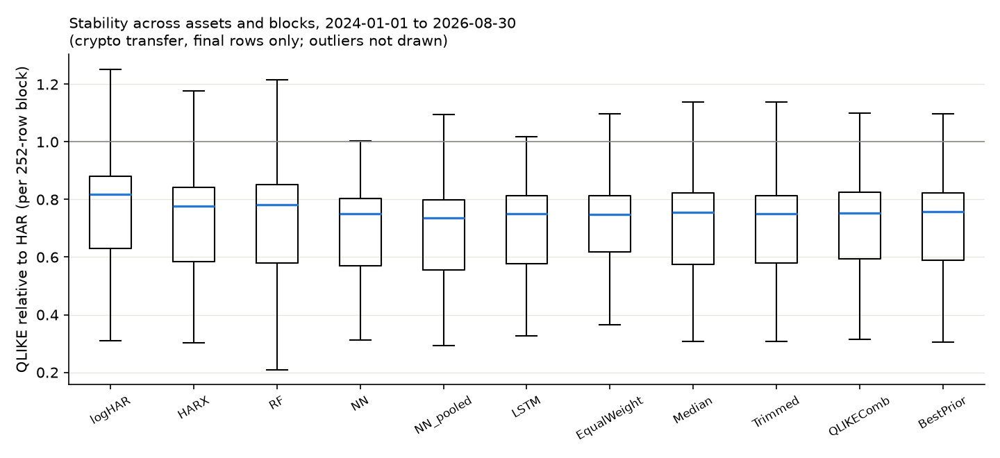

# Final results (crypto_g21_final)

Generation 2.1 data-correction rerun of `results/crypto_final/`: realized quarticity uses the span-aware scaling on days with missing 5-minute bars (`data/crypto_g21/`); models, hyperparameters, seeds, splits and evaluation are unchanged. The final rows were already exposed; this is a disclosed recomputation, not a new test.

Generated from `results/crypto_g21_final/` (config `4ed99606705e`, source tree `b0a61ff813e6`). Common evaluation rows 1826-2798 (2024-01-01 to 2026-08-30) for every asset and model. Crypto protocol transfer: eight Binance spot assets, 5-minute realized variance, the frozen stock protocol without retuning (no implied volatility, earnings or macro features). Target: next-day realized variance.

Status: disclosed recomputation of the exposed crypto final (see above).

## QLIKE relative to HAR by asset

| model         |   ADAUSDT |   BNBUSDT |   BTCUSDT |   ETHUSDT |   LTCUSDT |   TRXUSDT |   XLMUSDT |   XRPUSDT |
|:--------------|----------:|----------:|----------:|----------:|----------:|----------:|----------:|----------:|
| HAR           |     1.000 |     1.000 |     1.000 |     1.000 |     1.000 |     1.000 |     1.000 |     1.000 |
| logHAR        |     1.046 |     0.614 |     0.756 |     0.866 |     0.727 |     0.345 |     0.936 |     0.972 |
| HARX          |     1.153 |     0.794 |     0.709 |     0.818 |     0.893 |     0.323 |     1.033 |     0.891 |
| RF            |     1.015 |     0.580 |     0.708 |     0.861 |     0.692 |     0.409 |     0.957 |     0.868 |
| NN            |     1.095 |     0.624 |     0.693 |     0.789 |     0.935 |     0.327 |     1.044 |     0.850 |
| LSTM          |     1.021 |     0.575 |     0.701 |     0.807 |     0.695 |     0.346 |     0.964 |     0.857 |
| EqualWeight   |     0.979 |     0.617 |     0.707 |     0.782 |     0.737 |     0.444 |     0.893 |     0.853 |
| QLIKEComb     |     1.101 |     0.575 |     0.709 |     0.809 |     0.707 |     0.322 |     0.931 |     0.863 |
| BestPrior     |     1.128 |     0.789 |     0.708 |     0.811 |     0.894 |     0.323 |     0.964 |     0.857 |
| logHAR_pooled |     1.052 |     0.612 |     0.754 |     0.840 |     0.725 |     0.338 |     0.937 |     0.976 |
| RF_pooled     |     1.119 |     0.608 |     0.743 |     0.831 |     0.707 |     0.319 |     0.938 |     0.960 |
| NN_pooled     |     1.002 |     0.588 |     0.708 |     0.788 |     0.715 |     0.319 |     0.887 |     0.887 |
| Median        |     1.016 |     0.571 |     0.682 |     0.795 |     0.712 |     0.336 |     0.911 |     0.849 |
| Trimmed       |     1.000 |     0.569 |     0.690 |     0.796 |     0.701 |     0.338 |     0.907 |     0.853 |
| EW_wo_HAR     |     1.023 |     0.563 |     0.688 |     0.803 |     0.700 |     0.335 |     0.914 |     0.852 |
| EW_wo_HARX    |     0.977 |     0.637 |     0.718 |     0.784 |     0.753 |     0.489 |     0.901 |     0.854 |
| EW_wo_RF      |     0.983 |     0.639 |     0.721 |     0.783 |     0.758 |     0.478 |     0.890 |     0.857 |
| EW_wo_NN      |     0.961 |     0.636 |     0.721 |     0.789 |     0.740 |     0.482 |     0.896 |     0.860 |
| EW_wo_LSTM    |     0.977 |     0.638 |     0.720 |     0.788 |     0.753 |     0.476 |     0.886 |     0.859 |

## Newey-West t-statistic of the QLIKE gain over HAR (positive = better than HAR)

| model         |   ADAUSDT |   BNBUSDT |   BTCUSDT |   ETHUSDT |   LTCUSDT |   TRXUSDT |   XLMUSDT |   XRPUSDT |
|:--------------|----------:|----------:|----------:|----------:|----------:|----------:|----------:|----------:|
| HAR           |    nan    |    nan    |    nan    |    nan    |    nan    |    nan    |    nan    |    nan    |
| logHAR        |     -0.23 |      9.52 |      5.22 |      2.68 |      6.73 |     11.48 |      0.52 |      0.23 |
| HARX          |     -0.49 |      0.99 |      5.80 |      3.70 |      0.57 |     12.50 |     -0.14 |      1.23 |
| RF            |     -0.10 |      9.19 |      6.83 |      2.05 |      6.43 |      9.56 |      0.24 |      1.99 |
| NN            |     -0.34 |      6.37 |      6.48 |      3.85 |      0.31 |     13.57 |     -0.17 |      1.92 |
| LSTM          |     -0.11 |      8.25 |      7.02 |      3.49 |      7.53 |     14.51 |      0.19 |      2.02 |
| EqualWeight   |      0.14 |     11.57 |      8.96 |      6.12 |      9.74 |     18.38 |      0.99 |      2.79 |
| QLIKEComb     |     -0.42 |     10.40 |      7.84 |      3.42 |      7.70 |     12.83 |      0.47 |      3.26 |
| BestPrior     |     -0.46 |      1.02 |      5.74 |      3.32 |      0.56 |     12.50 |      0.19 |      2.02 |
| logHAR_pooled |     -0.24 |      9.96 |      5.41 |      3.48 |      6.88 |     12.77 |      0.51 |      0.19 |
| RF_pooled     |     -0.40 |      8.12 |      4.21 |      2.80 |      6.93 |     13.84 |      0.40 |      0.31 |
| NN_pooled     |     -0.01 |     10.38 |      5.68 |      4.43 |      6.53 |     13.88 |      0.94 |      1.11 |
| Median        |     -0.08 |     10.83 |      7.80 |      3.89 |      8.39 |     13.52 |      0.66 |      2.17 |
| Trimmed       |     -0.00 |     10.83 |      7.40 |      4.04 |      8.43 |     13.95 |      0.69 |      2.17 |
| EW_wo_HAR     |     -0.11 |     10.08 |      7.03 |      3.60 |      8.14 |     13.14 |      0.58 |      2.04 |
| EW_wo_HARX    |      0.17 |     11.53 |      9.61 |      6.50 |      9.96 |     19.39 |      0.91 |      3.12 |
| EW_wo_RF      |      0.12 |     11.85 |      9.16 |      6.87 |     10.23 |     19.90 |      1.17 |      2.83 |
| EW_wo_NN      |      0.32 |     11.38 |      9.41 |      6.51 |      9.29 |     19.02 |      1.01 |      2.93 |
| EW_wo_LSTM    |      0.17 |     12.47 |      9.08 |      6.54 |     10.08 |     18.85 |      1.23 |      2.88 |

## Average over assets: relative losses, bias, Mincer-Zarnowitz (RV = a + b f)

| model         |   QLIKE_rel_HAR |   MSE_rel_HAR |   MAE_rel_HAR |   bias_rel |   MZ_a |   MZ_b |
|:--------------|----------------:|--------------:|--------------:|-----------:|-------:|-------:|
| HAR           |           1.000 |         1.000 |         1.000 |      0.338 |  0.001 |  0.618 |
| logHAR        |           0.783 |         0.954 |         0.704 |     -0.083 |  0.001 |  0.639 |
| HARX          |           0.827 |         0.954 |         0.673 |     -0.073 |  0.001 |  0.746 |
| RF            |           0.761 |         0.923 |         0.671 |     -0.106 |  0.000 |  0.907 |
| NN            |           0.795 |         0.899 |         0.669 |     -0.079 |  0.001 |  0.836 |
| LSTM          |           0.746 |         0.908 |         0.670 |     -0.091 |  0.000 |  1.006 |
| EqualWeight   |           0.752 |         0.903 |         0.707 |     -0.002 |  0.000 |  0.865 |
| QLIKEComb     |           0.752 |         0.924 |         0.679 |     -0.059 |  0.000 |  0.824 |
| BestPrior     |           0.809 |         0.946 |         0.674 |     -0.077 |  0.001 |  0.753 |
| logHAR_pooled |           0.779 |         0.958 |         0.718 |     -0.050 |  0.001 |  0.627 |
| RF_pooled     |           0.778 |         0.913 |         0.651 |     -0.127 |  0.000 |  0.878 |
| NN_pooled     |           0.737 |         0.902 |         0.675 |     -0.051 |  0.001 |  0.753 |
| Median        |           0.734 |         0.897 |         0.665 |     -0.084 |  0.000 |  0.956 |
| Trimmed       |           0.732 |         0.900 |         0.667 |     -0.077 |  0.000 |  0.932 |
| EW_wo_HAR     |           0.735 |         0.902 |         0.660 |     -0.087 |  0.000 |  0.897 |
| EW_wo_HARX    |           0.764 |         0.906 |         0.722 |      0.016 |  0.000 |  0.892 |
| EW_wo_RF      |           0.764 |         0.903 |         0.721 |      0.024 |  0.000 |  0.848 |
| EW_wo_NN      |           0.761 |         0.908 |         0.721 |      0.017 |  0.000 |  0.853 |
| EW_wo_LSTM    |           0.762 |         0.908 |         0.723 |      0.020 |  0.000 |  0.810 |

## Pooled over asset-specific QLIKE (same rows; < 1 = pooled better)

| model   |   ADAUSDT |   BNBUSDT |   BTCUSDT |   ETHUSDT |   LTCUSDT |   TRXUSDT |   XLMUSDT |   XRPUSDT |
|:--------|----------:|----------:|----------:|----------:|----------:|----------:|----------:|----------:|
| NN      |     0.915 |     0.942 |     1.022 |     0.999 |     0.765 |     0.976 |     0.850 |     1.043 |
| RF      |     1.102 |     1.048 |     1.049 |     0.965 |     1.021 |     0.778 |     0.980 |     1.105 |
| logHAR  |     1.006 |     0.997 |     0.997 |     0.970 |     0.996 |     0.980 |     1.001 |     1.004 |

## Latest data-driven combination weights (grid on the simplex, prior OOS history)

|         |   HAR |   HARX |   RF |   NN |   LSTM |
|:--------|------:|-------:|-----:|-----:|-------:|
| BTCUSDT |  0.10 |   0.50 | 0.00 | 0.00 |   0.40 |
| ETHUSDT |  0.00 |   0.00 | 0.00 | 0.50 |   0.50 |
| BNBUSDT |  0.00 |   0.60 | 0.20 | 0.10 |   0.10 |
| XRPUSDT |  0.20 |   0.00 | 0.00 | 0.20 |   0.60 |
| ADAUSDT |  0.20 |   0.00 | 0.80 | 0.00 |   0.00 |
| LTCUSDT |  0.00 |   0.30 | 0.40 | 0.00 |   0.30 |
| TRXUSDT |  0.00 |   0.80 | 0.00 | 0.10 |   0.10 |
| XLMUSDT |  0.20 |   0.80 | 0.00 | 0.00 |   0.00 |

## QLIKE relative to HAR by calendar year (mean over assets)

|   year |   HARX |    NN |   EqualWeight |   QLIKEComb |   BestPrior |   Median |   NN_pooled |
|-------:|-------:|------:|--------------:|------------:|------------:|---------:|------------:|
|   2024 |  0.759 | 0.715 |         0.729 |       0.755 |       0.755 |    0.721 |       0.725 |
|   2025 |  1.003 | 0.961 |         0.841 |       0.850 |       0.975 |    0.841 |       0.853 |
|   2026 |  0.451 | 0.466 |         0.535 |       0.485 |       0.461 |    0.464 |       0.445 |

## Raw losses with cross-asset dependence preserved

Panel means over 973 dates x 8 assets. Intervals: 95% moving-block bootstrap over DATES (block 20, 2000 draws), every asset of a drawn date kept together. Ratios are shown as the pooled ratio of mean losses and as the mean of per-asset ratios (the form used in the tables above).

| model         |   raw QLIKE | difference vs HAR          | pooled ratio vs HAR   | mean of asset ratios   |
|:--------------|------------:|:---------------------------|:----------------------|:-----------------------|
| HAR           |      0.508  | 0.0000 [0.0000, 0.0000]    | 1.000 [1.000, 1.000]  | 1.000 [1.000, 1.000]   |
| logHAR        |      0.3837 | -0.1244 [-0.1887, -0.0471] | 0.755 [0.548, 0.933]  | 0.783 [0.598, 0.900]   |
| HARX          |      0.4077 | -0.1004 [-0.2013, 0.0606]  | 0.802 [0.516, 1.087]  | 0.827 [0.562, 1.024]   |
| RF            |      0.3761 | -0.1320 [-0.1885, -0.0703] | 0.740 [0.550, 0.898]  | 0.761 [0.589, 0.865]   |
| NN            |      0.3927 | -0.1153 [-0.2038, 0.0230]  | 0.773 [0.513, 1.033]  | 0.795 [0.557, 0.965]   |
| LSTM          |      0.3674 | -0.1407 [-0.1970, -0.0709] | 0.723 [0.530, 0.897]  | 0.746 [0.572, 0.855]   |
| EqualWeight   |      0.3738 | -0.1342 [-0.1754, -0.0821] | 0.736 [0.581, 0.881]  | 0.752 [0.611, 0.842]   |
| QLIKEComb     |      0.3707 | -0.1373 [-0.1950, -0.0637] | 0.730 [0.531, 0.912]  | 0.752 [0.581, 0.860]   |
| BestPrior     |      0.3988 | -0.1092 [-0.2012, 0.0340]  | 0.785 [0.516, 1.048]  | 0.809 [0.563, 0.995]   |
| logHAR_pooled |      0.3824 | -0.1256 [-0.1900, -0.0460] | 0.753 [0.545, 0.935]  | 0.779 [0.594, 0.899]   |
| RF_pooled     |      0.3824 | -0.1256 [-0.1999, -0.0217] | 0.753 [0.515, 0.970]  | 0.778 [0.560, 0.922]   |
| NN_pooled     |      0.3619 | -0.1462 [-0.2065, -0.0696] | 0.712 [0.505, 0.904]  | 0.737 [0.547, 0.864]   |
| Median        |      0.3617 | -0.1463 [-0.2015, -0.0779] | 0.712 [0.517, 0.888]  | 0.734 [0.560, 0.844]   |
| Trimmed       |      0.3602 | -0.1479 [-0.2008, -0.0831] | 0.709 [0.519, 0.880]  | 0.732 [0.562, 0.840]   |
| EW_wo_HAR     |      0.3619 | -0.1461 [-0.2031, -0.0763] | 0.712 [0.513, 0.890]  | 0.735 [0.557, 0.847]   |
| EW_wo_HARX    |      0.3815 | -0.1265 [-0.1646, -0.0781] | 0.751 [0.608, 0.887]  | 0.764 [0.633, 0.849]   |
| EW_wo_RF      |      0.3809 | -0.1271 [-0.1656, -0.0772] | 0.750 [0.604, 0.889]  | 0.764 [0.631, 0.850]   |
| EW_wo_NN      |      0.379  | -0.1290 [-0.1658, -0.0844] | 0.746 [0.605, 0.877]  | 0.761 [0.631, 0.843]   |
| EW_wo_LSTM    |      0.38   | -0.1281 [-0.1663, -0.0795] | 0.748 [0.603, 0.886]  | 0.762 [0.629, 0.849]   |

## Paired contrasts: where does the gain come from?

Negative difference: the first forecast has the lower loss. `MeanMemberLoss` is the average loss of the five equal-weight members, not a forecast. NW t: Newey-West (5 lags) t-statistic of the cross-asset mean daily difference.

| contrast               | a vs b                        | raw QLIKE a / b   | difference a - b           |   NW t | pooled ratio         |   assets a lower (of 8) |
|:-----------------------|:------------------------------|:------------------|:---------------------------|-------:|:---------------------|------------------------:|
| target_scale           | logHAR vs HAR                 | 0.3837 / 0.5080   | -0.1244 [-0.1887, -0.0471] |  -3.42 | 0.755 [0.548, 0.933] |                       7 |
| features               | HARX vs logHAR                | 0.4077 / 0.3837   | +0.0240 [-0.0203, +0.1090] |   0.6  | 1.063 [0.927, 1.196] |                       4 |
| nonlinear_RF           | RF vs HARX                    | 0.3761 / 0.4077   | -0.0316 [-0.1309, +0.0208] |  -0.68 | 0.922 [0.808, 1.086] |                       6 |
| nonlinear_NN           | NN vs HARX                    | 0.3927 / 0.4077   | -0.0150 [-0.0412, +0.0014] |  -1.15 | 0.963 [0.920, 1.006] |                       5 |
| nonlinear_LSTM         | LSTM vs HARX                  | 0.3674 / 0.4077   | -0.0403 [-0.1322, +0.0085] |  -0.97 | 0.901 [0.806, 1.039] |                       7 |
| pooling_logHAR         | logHAR_pooled vs logHAR       | 0.3824 / 0.3837   | -0.0013 [-0.0051, +0.0042] |  -0.56 | 0.997 [0.982, 1.007] |                       5 |
| pooling_RF             | RF_pooled vs RF               | 0.3824 / 0.3761   | +0.0064 [-0.0180, +0.0514] |   0.32 | 1.017 [0.926, 1.085] |                       3 |
| pooling_NN             | NN_pooled vs NN               | 0.3619 / 0.3927   | -0.0308 [-0.0925, +0.0022] |  -1.08 | 0.921 [0.859, 1.009] |                       6 |
| averaging_vs_selection | EqualWeight vs BestPrior      | 0.3738 / 0.3988   | -0.0250 [-0.1183, +0.0274] |  -0.6  | 0.937 [0.837, 1.128] |                       7 |
| averaging_vs_members   | EqualWeight vs MeanMemberLoss | 0.3738 / 0.4104   | -0.0365 [-0.0720, -0.0157] |  -2.26 | 0.911 [0.881, 0.941] |                       8 |
| protection_drop_HAR    | EW_wo_HAR vs EqualWeight      | 0.3619 / 0.3738   | -0.0119 [-0.0281, +0.0070] |  -1.27 | 0.968 [0.883, 1.012] |                       5 |
| protection_median      | Median vs EqualWeight         | 0.3617 / 0.3738   | -0.0122 [-0.0265, +0.0055] |  -1.45 | 0.967 [0.890, 1.009] |                       5 |
| protection_trimmed     | Trimmed vs EqualWeight        | 0.3602 / 0.3738   | -0.0137 [-0.0257, -0.0002] |  -2.03 | 0.963 [0.893, 1.000] |                       5 |
| context_pooled_NN      | EqualWeight vs NN_pooled      | 0.3738 / 0.3619   | +0.0120 [-0.0163, +0.0326] |   0.92 | 1.033 [0.974, 1.155] |                       4 |
| context_logHAR         | EqualWeight vs logHAR         | 0.3738 / 0.3837   | -0.0098 [-0.0386, +0.0152] |  -0.7  | 0.974 [0.932, 1.067] |                       5 |
| context_pooled_logHAR  | EqualWeight vs logHAR_pooled  | 0.3738 / 0.3824   | -0.0085 [-0.0407, +0.0165] |  -0.58 | 0.978 [0.934, 1.074] |                       5 |

### Sensitivity: without target days below 95% bar coverage

0 evaluation date(s) excluded (any asset with fewer than 274 of 288 bars on the target day); the same forecasts are rescored.

No evaluation date is affected; the table is unchanged.
