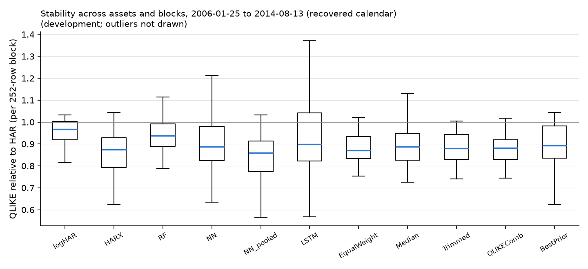

# Development results (dev)

Generated from `results/dev/` (config `4ed99606705e`, source tree `28b6e6ed6f1a`). Common evaluation rows 1252-3403 (2006-01-25 to 2014-08-13 (recovered calendar)) for every asset and model. Refits follow the frozen 252-row clock. Target: next-day realized variance.

Status: development sample.

## QLIKE relative to HAR by asset

| model         |   AAPL |    BA |   IBM |   JPM |    PG |
|:--------------|-------:|------:|------:|------:|------:|
| HAR           |  1.000 | 1.000 | 1.000 | 1.000 | 1.000 |
| logHAR        |  0.899 | 0.995 | 0.964 | 0.892 | 0.966 |
| HARX          |  0.822 | 0.878 | 0.905 | 0.861 | 1.809 |
| RF            |  0.922 | 0.930 | 0.987 | 1.088 | 1.035 |
| NN            |  0.905 | 1.128 | 0.931 | 0.878 | 2.249 |
| LSTM          |  0.948 | 0.912 | 1.046 | 1.056 | 1.180 |
| EqualWeight   |  0.862 | 0.877 | 0.920 | 0.851 | 0.977 |
| QLIKEComb     |  0.826 | 0.875 | 0.912 | 0.868 | 1.101 |
| BestPrior     |  0.822 | 0.878 | 0.905 | 0.894 | 1.211 |
| logHAR_pooled |  0.899 | 0.996 | 0.965 | 0.928 | 0.962 |
| RF_pooled     |  0.847 | 0.935 | 0.930 | 0.902 | 0.957 |
| NN_pooled     |  0.824 | 0.880 | 0.880 | 0.848 | 1.038 |
| HARX_macro    |  0.842 | 0.920 | 0.959 | 0.887 | 1.256 |
| RF_macro      |  0.929 | 0.937 | 0.998 | 1.088 | 1.058 |
| Median        |  0.859 | 0.880 | 0.930 | 0.871 | 1.081 |
| Trimmed       |  0.857 | 0.877 | 0.926 | 0.859 | 1.050 |
| EW_wo_HAR     |  0.857 | 0.878 | 0.922 | 0.875 | 1.118 |
| EW_wo_HARX    |  0.885 | 0.885 | 0.935 | 0.878 | 0.969 |
| EW_wo_RF      |  0.866 | 0.877 | 0.919 | 0.843 | 0.981 |
| EW_wo_NN      |  0.863 | 0.880 | 0.926 | 0.860 | 0.956 |
| EW_wo_LSTM    |  0.856 | 0.883 | 0.916 | 0.843 | 0.966 |

## Newey-West t-statistic of the QLIKE gain over HAR (positive = better than HAR)

| model         |   AAPL |     BA |    IBM |    JPM |     PG |
|:--------------|-------:|-------:|-------:|-------:|-------:|
| HAR           | nan    | nan    | nan    | nan    | nan    |
| logHAR        |   4.57 |   0.45 |   3.18 |   5.26 |   2.62 |
| HARX          |   7.51 |   6.24 |   5.13 |   5.20 |  -1.58 |
| RF            |   3.05 |   4.29 |   0.55 |  -1.21 |  -0.80 |
| NN            |   3.16 |  -0.78 |   3.34 |   4.30 |  -1.72 |
| LSTM          |   1.40 |   3.00 |  -1.05 |  -1.00 |  -1.39 |
| EqualWeight   |   8.47 |   7.35 |   5.80 |   7.16 |   0.54 |
| QLIKEComb     |   8.57 |   6.70 |   5.84 |   5.06 |  -1.20 |
| BestPrior     |   7.51 |   6.24 |   5.13 |   3.78 |  -1.65 |
| logHAR_pooled |   4.46 |   0.35 |   3.13 |   3.23 |   3.23 |
| RF_pooled     |   6.62 |   2.84 |   2.96 |   2.83 |   1.17 |
| NN_pooled     |   9.02 |   5.55 |   5.88 |   5.50 |  -0.23 |
| HARX_macro    |   5.01 |   3.41 |   1.31 |   3.44 |  -1.10 |
| RF_macro      |   2.46 |   3.65 |   0.08 |  -1.24 |  -1.27 |
| Median        |   7.27 |   6.33 |   4.40 |   5.34 |  -0.76 |
| Trimmed       |   7.55 |   6.82 |   4.94 |   5.81 |  -0.59 |
| EW_wo_HAR     |   6.53 |   5.54 |   4.51 |   4.47 |  -1.04 |
| EW_wo_HARX    |   7.14 |   7.12 |   4.78 |   5.75 |   0.92 |
| EW_wo_RF      |   8.83 |   7.14 |   5.60 |   8.04 |   0.43 |
| EW_wo_NN      |   8.98 |   7.95 |   5.93 |   7.08 |   1.36 |
| EW_wo_LSTM    |   9.62 |   7.75 |   6.70 |   8.22 |   0.97 |

## Average over assets: relative losses, bias, Mincer-Zarnowitz (RV = a + b f)

| model         |   QLIKE_rel_HAR |   MSE_rel_HAR |   MAE_rel_HAR |   bias_rel |   MZ_a |   MZ_b |
|:--------------|----------------:|--------------:|--------------:|-----------:|-------:|-------:|
| HAR           |           1.000 |         1.000 |         1.000 |      0.021 | -0.000 |  0.983 |
| logHAR        |           0.943 |         0.972 |         0.956 |     -0.024 | -0.000 |  1.051 |
| HARX          |           1.055 |         0.965 |         0.958 |     -0.008 |  0.000 |  0.954 |
| RF            |           0.992 |         1.225 |         0.995 |     -0.115 | -0.000 |  1.364 |
| NN            |           1.219 |         1.070 |         0.956 |     -0.052 |  0.000 |  1.057 |
| LSTM          |           1.029 |         1.316 |         1.019 |     -0.128 | -0.000 |  1.484 |
| EqualWeight   |           0.898 |         0.955 |         0.924 |     -0.056 | -0.000 |  1.276 |
| QLIKEComb     |           0.916 |         0.967 |         0.936 |     -0.058 | -0.000 |  1.206 |
| BestPrior     |           0.942 |         0.961 |         0.944 |     -0.044 |  0.000 |  1.095 |
| logHAR_pooled |           0.950 |         0.989 |         0.956 |     -0.031 | -0.000 |  1.061 |
| RF_pooled     |           0.914 |         1.072 |         0.911 |     -0.150 | -0.000 |  1.446 |
| NN_pooled     |           0.894 |         0.883 |         0.907 |     -0.028 |  0.000 |  1.072 |
| HARX_macro    |           0.973 |         2.445 |         1.184 |      0.163 |  0.000 |  0.522 |
| RF_macro      |           1.002 |         1.221 |         0.999 |     -0.108 | -0.000 |  1.346 |
| Median        |           0.924 |         1.039 |         0.938 |     -0.072 | -0.000 |  1.230 |
| Trimmed       |           0.914 |         1.011 |         0.930 |     -0.075 | -0.000 |  1.281 |
| EW_wo_HAR     |           0.930 |         1.013 |         0.939 |     -0.076 | -0.000 |  1.268 |
| EW_wo_HARX    |           0.910 |         1.017 |         0.932 |     -0.068 | -0.000 |  1.339 |
| EW_wo_RF      |           0.897 |         0.919 |         0.922 |     -0.042 | -0.000 |  1.226 |
| EW_wo_NN      |           0.897 |         0.960 |         0.926 |     -0.057 | -0.000 |  1.304 |
| EW_wo_LSTM    |           0.893 |         0.914 |         0.923 |     -0.038 | -0.000 |  1.195 |

## Pooled over asset-specific QLIKE (same rows; < 1 = pooled better)

| model   |   AAPL |    BA |   IBM |   JPM |    PG |
|:--------|-------:|------:|------:|------:|------:|
| NN      |  0.910 | 0.780 | 0.945 | 0.965 | 0.461 |
| RF      |  0.919 | 1.006 | 0.942 | 0.829 | 0.925 |
| logHAR  |  1.001 | 1.001 | 1.001 | 1.041 | 0.995 |

## Latest data-driven combination weights (grid on the simplex, prior OOS history)

|      |   HAR |   HARX |   RF |   NN |   LSTM |
|:-----|------:|-------:|-----:|-----:|-------:|
| AAPL |  0.10 |   0.90 | 0.00 | 0.00 |   0.00 |
| JPM  |  0.20 |   0.70 | 0.00 | 0.10 |   0.00 |
| IBM  |  0.00 |   0.80 | 0.10 | 0.10 |   0.00 |
| BA   |  0.00 |   0.60 | 0.20 | 0.00 |   0.20 |
| PG   |  0.50 |   0.20 | 0.10 | 0.00 |   0.20 |

## QLIKE relative to HAR by calendar year (mean over assets)

|   year |   HARX |    NN |   EqualWeight |   QLIKEComb |   BestPrior |   Median |   NN_pooled |
|-------:|-------:|------:|--------------:|------------:|------------:|---------:|------------:|
|   2006 |  0.839 | 0.875 |         0.841 |       0.837 |       0.839 |    0.843 |       0.821 |
|   2007 |  0.928 | 0.924 |         0.914 |       0.914 |       0.931 |    0.918 |       0.909 |
|   2008 |  2.164 | 3.185 |         0.998 |       1.156 |       1.282 |    1.221 |       1.140 |
|   2009 |  1.102 | 1.111 |         1.065 |       0.994 |       0.989 |    1.055 |       0.972 |
|   2010 |  0.947 | 1.067 |         0.985 |       0.945 |       0.911 |    0.980 |       0.937 |
|   2011 |  0.826 | 0.838 |         0.834 |       0.862 |       0.875 |    0.827 |       0.821 |
|   2012 |  0.819 | 0.823 |         0.829 |       0.847 |       0.869 |    0.827 |       0.814 |
|   2013 |  0.813 | 0.842 |         0.828 |       0.841 |       0.873 |    0.818 |       0.802 |
|   2014 |  0.708 | 0.724 |         0.745 |       0.755 |       0.779 |    0.724 |       0.707 |

## Raw losses with cross-asset dependence preserved

Panel means over 2152 dates x 5 assets. Intervals: 95% moving-block bootstrap over DATES (block 20, 2000 draws), every asset of a drawn date kept together. Ratios are shown as the pooled ratio of mean losses and as the mean of per-asset ratios (the form used in the tables above).

| model         |   raw QLIKE | difference vs HAR          | pooled ratio vs HAR   | mean of asset ratios   |
|:--------------|------------:|:---------------------------|:----------------------|:-----------------------|
| HAR           |      0.162  | 0.0000 [0.0000, 0.0000]    | 1.000 [1.000, 1.000]  | 1.000 [1.000, 1.000]   |
| logHAR        |      0.1522 | -0.0098 [-0.0131, -0.0064] | 0.940 [0.919, 0.961]  | 0.943 [0.924, 0.963]   |
| HARX          |      0.1673 | 0.0054 [-0.0222, 0.0549]   | 1.033 [0.861, 1.335]  | 1.055 [0.867, 1.370]   |
| RF            |      0.1597 | -0.0022 [-0.0115, 0.0098]  | 0.986 [0.928, 1.060]  | 0.992 [0.932, 1.068]   |
| NN            |      0.193  | 0.0311 [-0.0160, 0.1141]   | 1.192 [0.899, 1.692]  | 1.219 [0.903, 1.759]   |
| LSTM          |      0.1652 | 0.0032 [-0.0136, 0.0276]   | 1.020 [0.914, 1.169]  | 1.029 [0.917, 1.183]   |
| EqualWeight   |      0.1447 | -0.0172 [-0.0217, -0.0118] | 0.894 [0.864, 0.928]  | 0.898 [0.867, 0.932]   |
| QLIKEComb     |      0.147  | -0.0149 [-0.0216, -0.0054] | 0.908 [0.864, 0.968]  | 0.916 [0.872, 0.978]   |
| BestPrior     |      0.1508 | -0.0112 [-0.0200, 0.0029]  | 0.931 [0.874, 1.017]  | 0.942 [0.882, 1.030]   |
| logHAR_pooled |      0.1532 | -0.0087 [-0.0121, -0.0054] | 0.946 [0.925, 0.967]  | 0.950 [0.930, 0.970]   |
| RF_pooled     |      0.1472 | -0.0148 [-0.0207, -0.0072] | 0.909 [0.866, 0.958]  | 0.914 [0.870, 0.964]   |
| NN_pooled     |      0.1437 | -0.0182 [-0.0264, -0.0051] | 0.888 [0.832, 0.969]  | 0.894 [0.834, 0.979]   |
| Median        |      0.1486 | -0.0133 [-0.0214, -0.0017] | 0.918 [0.865, 0.989]  | 0.924 [0.869, 1.000]   |
| Trimmed       |      0.1471 | -0.0149 [-0.0219, -0.0053] | 0.908 [0.863, 0.968]  | 0.914 [0.867, 0.977]   |
| EW_wo_HAR     |      0.1494 | -0.0125 [-0.0215, 0.0003]  | 0.923 [0.865, 1.002]  | 0.930 [0.870, 1.012]   |
| EW_wo_HARX    |      0.1469 | -0.0150 [-0.0198, -0.0094] | 0.907 [0.877, 0.943]  | 0.910 [0.879, 0.947]   |
| EW_wo_RF      |      0.1448 | -0.0172 [-0.0215, -0.0121] | 0.894 [0.866, 0.927]  | 0.897 [0.868, 0.931]   |
| EW_wo_NN      |      0.1447 | -0.0173 [-0.0213, -0.0126] | 0.893 [0.867, 0.923]  | 0.897 [0.871, 0.928]   |
| EW_wo_LSTM    |      0.1439 | -0.0180 [-0.0216, -0.0139] | 0.889 [0.865, 0.916]  | 0.893 [0.868, 0.920]   |

## Paired contrasts: where does the gain come from?

Negative difference: the first forecast has the lower loss. `MeanMemberLoss` is the average loss of the five equal-weight members, not a forecast. NW t: Newey-West (5 lags) t-statistic of the cross-asset mean daily difference.

| contrast               | a vs b                        | raw QLIKE a / b   | difference a - b           |   NW t | pooled ratio         |   assets a lower (of 5) |
|:-----------------------|:------------------------------|:------------------|:---------------------------|-------:|:---------------------|------------------------:|
| target_scale           | logHAR vs HAR                 | 0.1522 / 0.1620   | -0.0098 [-0.0131, -0.0064] |  -6.04 | 0.940 [0.919, 0.961] |                       5 |
| features               | HARX vs logHAR                | 0.1673 / 0.1522   | +0.0151 [-0.0122, +0.0637] |   1    | 1.100 [0.919, 1.410] |                       4 |
| nonlinear_RF           | RF vs HARX                    | 0.1597 / 0.1673   | -0.0076 [-0.0475, +0.0137] |  -0.6  | 0.955 [0.782, 1.098] |                       1 |
| nonlinear_NN           | NN vs HARX                    | 0.1930 / 0.1673   | +0.0257 [+0.0047, +0.0608] |   2.11 | 1.154 [1.035, 1.290] |                       0 |
| nonlinear_LSTM         | LSTM vs HARX                  | 0.1652 / 0.1673   | -0.0021 [-0.0295, +0.0129] |  -0.22 | 0.987 [0.868, 1.091] |                       1 |
| pooling_logHAR         | logHAR_pooled vs logHAR       | 0.1532 / 0.1522   | +0.0010 [+0.0003, +0.0019] |   2.85 | 1.007 [1.002, 1.012] |                       1 |
| pooling_RF             | RF_pooled vs RF               | 0.1472 / 0.1597   | -0.0126 [-0.0196, -0.0063] |  -4.38 | 0.921 [0.883, 0.961] |                       4 |
| pooling_NN             | NN_pooled vs NN               | 0.1437 / 0.1930   | -0.0493 [-0.1220, -0.0076] |  -2.06 | 0.745 [0.562, 0.947] |                       5 |
| averaging_vs_selection | EqualWeight vs BestPrior      | 0.1447 / 0.1508   | -0.0060 [-0.0156, +0.0004] |  -2.09 | 0.960 [0.906, 1.003] |                       3 |
| averaging_vs_members   | EqualWeight vs MeanMemberLoss | 0.1447 / 0.1694   | -0.0247 [-0.0535, -0.0074] |  -2.78 | 0.854 [0.737, 0.950] |                       5 |
| protection_drop_HAR    | EW_wo_HAR vs EqualWeight      | 0.1494 / 0.1447   | +0.0047 [-0.0004, +0.0131] |   1.78 | 1.032 [0.997, 1.087] |                       1 |
| protection_median      | Median vs EqualWeight         | 0.1486 / 0.1447   | +0.0039 [-0.0007, +0.0111] |   1.71 | 1.027 [0.995, 1.074] |                       1 |
| protection_trimmed     | Trimmed vs EqualWeight        | 0.1471 / 0.1447   | +0.0023 [-0.0008, +0.0075] |   1.44 | 1.016 [0.994, 1.049] |                       1 |
| context_pooled_NN      | EqualWeight vs NN_pooled      | 0.1447 / 0.1437   | +0.0010 [-0.0085, +0.0066] |   0.23 | 1.007 [0.946, 1.050] |                       2 |
| context_logHAR         | EqualWeight vs logHAR         | 0.1447 / 0.1522   | -0.0074 [-0.0123, -0.0020] |  -3.6  | 0.951 [0.919, 0.986] |                       4 |
| context_pooled_logHAR  | EqualWeight vs logHAR_pooled  | 0.1447 / 0.1532   | -0.0085 [-0.0132, -0.0031] |  -4.09 | 0.945 [0.914, 0.979] |                       4 |
