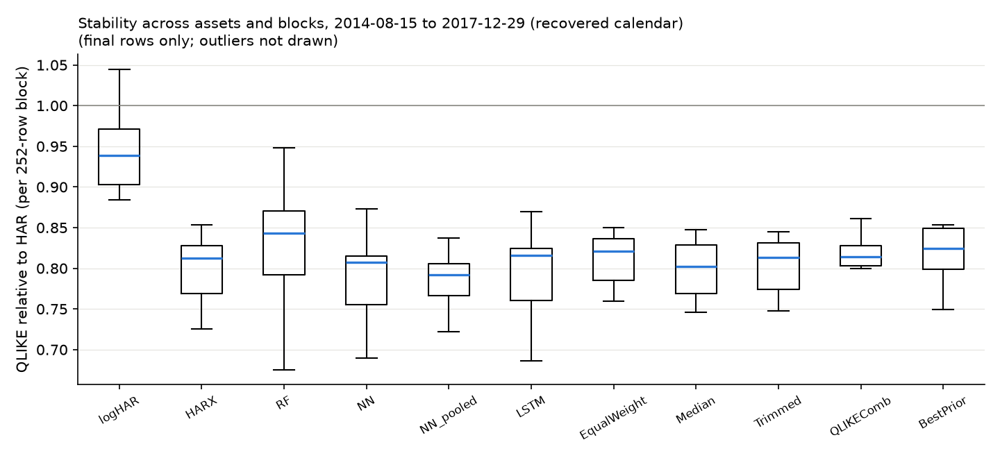

# Final results (final)

Generated from `results/final/` (config `4ed99606705e`, source tree `28b6e6ed6f1a`). Common evaluation rows 3405-4255 (2014-08-15 to 2017-12-29 (recovered calendar)) for every asset and model. Refits follow the frozen 252-row clock. Target: next-day realized variance.

Status: archival stock final (supplied, undated files; calendar inferred), not used for any design decision and evaluated once with the frozen procedure on 2026-09-24; the AAPL rows of this block were viewed in the original exercise, and the pooled network's refits use them.

## QLIKE relative to HAR by asset

| model         |   AAPL |    BA |   IBM |   JPM |    PG |
|:--------------|-------:|------:|------:|------:|------:|
| HAR           |  1.000 | 1.000 | 1.000 | 1.000 | 1.000 |
| logHAR        |  0.884 | 1.003 | 0.955 | 0.822 | 0.942 |
| HARX          |  0.791 | 0.824 | 0.816 | 0.745 | 0.798 |
| RF            |  0.820 | 0.938 | 0.863 | 0.729 | 0.826 |
| NN            |  0.776 | 0.795 | 0.838 | 0.718 | 0.835 |
| LSTM          |  0.789 | 0.804 | 0.839 | 0.735 | 0.789 |
| EqualWeight   |  0.795 | 0.831 | 0.843 | 0.743 | 0.819 |
| QLIKEComb     |  0.792 | 0.818 | 0.819 | 0.739 | 0.859 |
| BestPrior     |  0.791 | 0.824 | 0.816 | 0.745 | 0.926 |
| logHAR_pooled |  0.880 | 0.999 | 0.951 | 0.828 | 0.944 |
| RF_pooled     |  0.837 | 0.871 | 0.832 | 0.743 | 0.856 |
| NN_pooled     |  0.776 | 0.808 | 0.807 | 0.732 | 0.795 |
| HARX_macro    |  0.794 | 0.826 | 0.816 | 0.749 | 0.795 |
| RF_macro      |  0.821 | 0.921 | 0.854 | 0.700 | 0.817 |
| Median        |  0.786 | 0.809 | 0.841 | 0.723 | 0.799 |
| Trimmed       |  0.789 | 0.818 | 0.838 | 0.725 | 0.807 |
| EW_wo_HAR     |  0.781 | 0.816 | 0.826 | 0.719 | 0.796 |
| EW_wo_HARX    |  0.802 | 0.838 | 0.855 | 0.750 | 0.829 |
| EW_wo_RF      |  0.798 | 0.821 | 0.844 | 0.754 | 0.827 |
| EW_wo_NN      |  0.805 | 0.848 | 0.851 | 0.756 | 0.821 |
| EW_wo_LSTM    |  0.805 | 0.846 | 0.849 | 0.753 | 0.833 |

## Newey-West t-statistic of the QLIKE gain over HAR (positive = better than HAR)

| model         |   AAPL |     BA |    IBM |    JPM |     PG |
|:--------------|-------:|-------:|-------:|-------:|-------:|
| HAR           | nan    | nan    | nan    | nan    | nan    |
| logHAR        |   1.91 |  -0.10 |   2.41 |   3.51 |   2.53 |
| HARX          |   3.78 |   4.54 |   4.56 |   7.46 |   4.32 |
| RF            |   3.34 |   1.24 |   3.35 |   7.52 |   3.34 |
| NN            |   4.75 |   5.04 |   4.00 |   6.98 |   5.07 |
| LSTM          |   4.02 |   4.93 |   4.21 |   6.76 |   3.50 |
| EqualWeight   |   5.37 |   5.50 |   4.59 |   9.73 |   4.57 |
| QLIKEComb     |   4.35 |   5.04 |   4.56 |   9.30 |   4.70 |
| BestPrior     |   3.78 |   4.54 |   4.56 |   7.46 |   4.28 |
| logHAR_pooled |   2.25 |   0.04 |   2.49 |   3.01 |   2.32 |
| RF_pooled     |   2.74 |   3.95 |   3.66 |   6.37 |   3.12 |
| NN_pooled     |   5.32 |   5.09 |   4.12 |   7.33 |   4.21 |
| HARX_macro    |   3.69 |   4.49 |   4.53 |   7.05 |   4.24 |
| RF_macro      |   3.37 |   1.60 |   3.48 |   6.93 |   2.84 |
| Median        |   4.31 |   5.37 |   4.49 |   8.47 |   4.26 |
| Trimmed       |   4.35 |   5.62 |   4.53 |   8.50 |   4.65 |
| EW_wo_HAR     |   4.28 |   5.27 |   4.39 |   8.05 |   4.34 |
| EW_wo_HARX    |   5.75 |   5.55 |   4.45 |   9.47 |   4.56 |
| EW_wo_RF      |   5.75 |   5.55 |   4.68 |  10.05 |   4.70 |
| EW_wo_NN      |   5.36 |   5.35 |   4.68 |  10.45 |   4.22 |
| EW_wo_LSTM    |   5.56 |   5.24 |   4.56 |  10.19 |   4.99 |

## Average over assets: relative losses, bias, Mincer-Zarnowitz (RV = a + b f)

| model         |   QLIKE_rel_HAR |   MSE_rel_HAR |   MAE_rel_HAR |   bias_rel |   MZ_a |   MZ_b |
|:--------------|----------------:|--------------:|--------------:|-----------:|-------:|-------:|
| HAR           |           1.000 |         1.000 |         1.000 |      0.157 |  0.000 |  0.596 |
| logHAR        |           0.921 |         0.924 |         0.844 |     -0.018 |  0.000 |  0.794 |
| HARX          |           0.795 |         0.858 |         0.767 |     -0.056 | -0.000 |  1.139 |
| RF            |           0.835 |         0.883 |         0.795 |     -0.045 | -0.000 |  1.058 |
| NN            |           0.792 |         0.869 |         0.776 |     -0.037 | -0.000 |  1.064 |
| LSTM          |           0.791 |         0.865 |         0.771 |     -0.048 | -0.000 |  1.235 |
| EqualWeight   |           0.806 |         0.874 |         0.800 |     -0.006 | -0.000 |  1.034 |
| QLIKEComb     |           0.805 |         0.865 |         0.790 |     -0.024 | -0.000 |  1.054 |
| BestPrior     |           0.820 |         0.874 |         0.793 |     -0.034 | -0.000 |  1.022 |
| logHAR_pooled |           0.920 |         0.925 |         0.853 |     -0.008 |  0.000 |  0.784 |
| RF_pooled     |           0.828 |         0.876 |         0.762 |     -0.096 | -0.000 |  1.109 |
| NN_pooled     |           0.783 |         0.857 |         0.768 |     -0.044 | -0.000 |  1.087 |
| HARX_macro    |           0.796 |         0.859 |         0.765 |     -0.064 | -0.000 |  1.183 |
| RF_macro      |           0.823 |         0.873 |         0.784 |     -0.057 | -0.000 |  1.133 |
| Median        |           0.792 |         0.869 |         0.779 |     -0.034 | -0.000 |  1.115 |
| Trimmed       |           0.795 |         0.870 |         0.781 |     -0.033 | -0.000 |  1.110 |
| EW_wo_HAR     |           0.788 |         0.862 |         0.769 |     -0.046 | -0.000 |  1.162 |
| EW_wo_HARX    |           0.815 |         0.881 |         0.812 |      0.007 | -0.000 |  0.997 |
| EW_wo_RF      |           0.809 |         0.875 |         0.806 |      0.004 | -0.000 |  1.016 |
| EW_wo_NN      |           0.816 |         0.879 |         0.811 |      0.002 | -0.000 |  1.013 |
| EW_wo_LSTM    |           0.817 |         0.882 |         0.813 |      0.005 |  0.000 |  0.969 |

## Pooled over asset-specific QLIKE (same rows; < 1 = pooled better)

| model   |   AAPL |    BA |   IBM |   JPM |    PG |
|:--------|-------:|------:|------:|------:|------:|
| NN      |  1.000 | 1.016 | 0.962 | 1.019 | 0.953 |
| RF      |  1.021 | 0.929 | 0.964 | 1.020 | 1.037 |
| logHAR  |  0.995 | 0.996 | 0.995 | 1.007 | 1.002 |

## Latest data-driven combination weights (grid on the simplex, prior OOS history)

|      |   HAR |   HARX |   RF |   NN |   LSTM |
|:-----|------:|-------:|-----:|-----:|-------:|
| AAPL |  0.10 |   0.90 | 0.00 | 0.00 |   0.00 |
| JPM  |  0.10 |   0.50 | 0.10 | 0.30 |   0.00 |
| IBM  |  0.00 |   0.90 | 0.10 | 0.00 |   0.00 |
| BA   |  0.00 |   0.60 | 0.10 | 0.00 |   0.30 |
| PG   |  0.40 |   0.20 | 0.10 | 0.00 |   0.30 |

## QLIKE relative to HAR by calendar year (mean over assets)

|   year |   HARX |    NN |   EqualWeight |   QLIKEComb |   BestPrior |   Median |   NN_pooled |
|-------:|-------:|------:|--------------:|------------:|------------:|---------:|------------:|
|   2014 |  0.802 | 0.815 |         0.833 |       0.826 |       0.831 |    0.818 |       0.777 |
|   2015 |  0.784 | 0.785 |         0.793 |       0.798 |       0.829 |    0.774 |       0.770 |
|   2016 |  0.812 | 0.813 |         0.816 |       0.809 |       0.815 |    0.809 |       0.806 |
|   2017 |  0.774 | 0.760 |         0.792 |       0.786 |       0.786 |    0.775 |       0.771 |

## Raw losses with cross-asset dependence preserved

Panel means over 851 dates x 5 assets. Intervals: 95% moving-block bootstrap over DATES (block 20, 2000 draws), every asset of a drawn date kept together. Ratios are shown as the pooled ratio of mean losses and as the mean of per-asset ratios (the form used in the tables above).

| model         |   raw QLIKE | difference vs HAR          | pooled ratio vs HAR   | mean of asset ratios   |
|:--------------|------------:|:---------------------------|:----------------------|:-----------------------|
| HAR           |      0.2121 | 0.0000 [0.0000, 0.0000]    | 1.000 [1.000, 1.000]  | 1.000 [1.000, 1.000]   |
| logHAR        |      0.1949 | -0.0172 [-0.0233, -0.0079] | 0.919 [0.877, 0.966]  | 0.921 [0.881, 0.965]   |
| HARX          |      0.1684 | -0.0436 [-0.0542, -0.0322] | 0.794 [0.746, 0.840]  | 0.795 [0.747, 0.837]   |
| RF            |      0.1769 | -0.0352 [-0.0485, -0.0229] | 0.834 [0.791, 0.883]  | 0.835 [0.794, 0.876]   |
| NN            |      0.1677 | -0.0444 [-0.0551, -0.0333] | 0.791 [0.738, 0.834]  | 0.792 [0.739, 0.835]   |
| LSTM          |      0.1675 | -0.0445 [-0.0575, -0.0317] | 0.790 [0.739, 0.836]  | 0.791 [0.741, 0.836]   |
| EqualWeight   |      0.1707 | -0.0413 [-0.0510, -0.0320] | 0.805 [0.766, 0.839]  | 0.806 [0.766, 0.838]   |
| QLIKEComb     |      0.1706 | -0.0414 [-0.0509, -0.0316] | 0.805 [0.760, 0.843]  | 0.805 [0.763, 0.841]   |
| BestPrior     |      0.1738 | -0.0383 [-0.0468, -0.0288] | 0.819 [0.770, 0.865]  | 0.820 [0.773, 0.862]   |
| logHAR_pooled |      0.1947 | -0.0174 [-0.0232, -0.0084] | 0.918 [0.877, 0.964]  | 0.920 [0.883, 0.964]   |
| RF_pooled     |      0.1757 | -0.0364 [-0.0465, -0.0241] | 0.828 [0.782, 0.879]  | 0.828 [0.782, 0.875]   |
| NN_pooled     |      0.166  | -0.0461 [-0.0579, -0.0344] | 0.783 [0.738, 0.826]  | 0.783 [0.739, 0.824]   |
| Median        |      0.1676 | -0.0445 [-0.0559, -0.0332] | 0.790 [0.745, 0.831]  | 0.792 [0.747, 0.829]   |
| Trimmed       |      0.1684 | -0.0437 [-0.0544, -0.0329] | 0.794 [0.749, 0.834]  | 0.795 [0.751, 0.832]   |
| EW_wo_HAR     |      0.1668 | -0.0453 [-0.0570, -0.0336] | 0.787 [0.739, 0.829]  | 0.788 [0.741, 0.827]   |
| EW_wo_HARX    |      0.1725 | -0.0396 [-0.0492, -0.0308] | 0.813 [0.776, 0.844]  | 0.815 [0.777, 0.844]   |
| EW_wo_RF      |      0.1713 | -0.0408 [-0.0498, -0.0320] | 0.808 [0.767, 0.840]  | 0.809 [0.768, 0.841]   |
| EW_wo_NN      |      0.1728 | -0.0393 [-0.0488, -0.0303] | 0.815 [0.779, 0.847]  | 0.816 [0.780, 0.845]   |
| EW_wo_LSTM    |      0.173  | -0.0391 [-0.0479, -0.0305] | 0.816 [0.779, 0.847]  | 0.817 [0.779, 0.847]   |

## Paired contrasts: where does the gain come from?

Negative difference: the first forecast has the lower loss. `MeanMemberLoss` is the average loss of the five equal-weight members, not a forecast. NW t: Newey-West (5 lags) t-statistic of the cross-asset mean daily difference.

| contrast               | a vs b                        | raw QLIKE a / b   | difference a - b           |   NW t | pooled ratio         |   assets a lower (of 5) |
|:-----------------------|:------------------------------|:------------------|:---------------------------|-------:|:---------------------|------------------------:|
| target_scale           | logHAR vs HAR                 | 0.1949 / 0.2121   | -0.0172 [-0.0233, -0.0079] |  -3.74 | 0.919 [0.877, 0.966] |                       4 |
| features               | HARX vs logHAR                | 0.1684 / 0.1949   | -0.0265 [-0.0387, -0.0174] |  -5.04 | 0.864 [0.827, 0.897] |                       5 |
| nonlinear_RF           | RF vs HARX                    | 0.1769 / 0.1684   | +0.0084 [+0.0011, +0.0148] |   2.67 | 1.050 [1.006, 1.096] |                       1 |
| nonlinear_NN           | NN vs HARX                    | 0.1677 / 0.1684   | -0.0008 [-0.0045, +0.0018] |  -0.45 | 0.995 [0.972, 1.010] |                       3 |
| nonlinear_LSTM         | LSTM vs HARX                  | 0.1675 / 0.1684   | -0.0009 [-0.0059, +0.0025] |  -0.41 | 0.995 [0.969, 1.016] |                       4 |
| pooling_logHAR         | logHAR_pooled vs logHAR       | 0.1947 / 0.1949   | -0.0002 [-0.0013, +0.0007] |  -0.39 | 0.999 [0.993, 1.004] |                       3 |
| pooling_RF             | RF_pooled vs RF               | 0.1757 / 0.1769   | -0.0012 [-0.0060, +0.0054] |  -0.39 | 0.993 [0.964, 1.026] |                       2 |
| pooling_NN             | NN_pooled vs NN               | 0.1660 / 0.1677   | -0.0017 [-0.0055, +0.0027] |  -0.84 | 0.990 [0.973, 1.018] |                       2 |
| averaging_vs_selection | EqualWeight vs BestPrior      | 0.1707 / 0.1738   | -0.0031 [-0.0086, +0.0004] |  -1.34 | 0.982 [0.960, 1.003] |                       2 |
| averaging_vs_members   | EqualWeight vs MeanMemberLoss | 0.1707 / 0.1785   | -0.0078 [-0.0091, -0.0067] | -12.55 | 0.956 [0.946, 0.964] |                       5 |
| protection_drop_HAR    | EW_wo_HAR vs EqualWeight      | 0.1668 / 0.1707   | -0.0039 [-0.0061, -0.0016] |  -3.18 | 0.977 [0.965, 0.991] |                       5 |
| protection_median      | Median vs EqualWeight         | 0.1676 / 0.1707   | -0.0031 [-0.0051, -0.0011] |  -2.91 | 0.982 [0.970, 0.993] |                       5 |
| protection_trimmed     | Trimmed vs EqualWeight        | 0.1684 / 0.1707   | -0.0023 [-0.0039, -0.0007] |  -2.7  | 0.986 [0.977, 0.996] |                       5 |
| context_pooled_NN      | EqualWeight vs NN_pooled      | 0.1707 / 0.1660   | +0.0048 [+0.0018, +0.0072] |   3.23 | 1.029 [1.011, 1.043] |                       0 |
| context_logHAR         | EqualWeight vs logHAR         | 0.1707 / 0.1949   | -0.0242 [-0.0375, -0.0159] |  -4.44 | 0.876 [0.842, 0.904] |                       5 |
| context_pooled_logHAR  | EqualWeight vs logHAR_pooled  | 0.1707 / 0.1947   | -0.0239 [-0.0374, -0.0155] |  -4.4  | 0.877 [0.841, 0.906] |                       5 |
